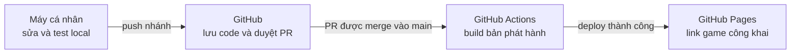
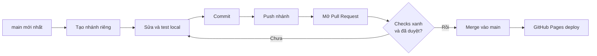

# Sổ tay web game Sentience

Hướng dẫn chạy game trên máy, sửa nội dung, tạo Pull Request, duyệt, merge và phát hành lên GitHub Pages.

- Repository: [karinaimk4/sentience-shattered-memories](https://github.com/karinaimk4/sentience-shattered-memories)
- Link chơi: [Sentience: Shattered Memories](https://karinaimk4.github.io/sentience-shattered-memories/)
- Nguồn game chính: `gameplay-v4/`

> Quy tắc quan trọng nhất: **không sửa hoặc push thẳng vào `main`**. Mỗi nhóm thay đổi phải đi qua một nhánh riêng và một Pull Request.

## Mục lục

1. [Ba nơi, ba việc](#1-ba-nơi-ba-việc)
2. [Cấu trúc dự án](#2-cấu-trúc-dự-án)
3. [Chạy và kiểm tra trên máy](#3-chạy-và-kiểm-tra-trên-máy)
4. [Quy trình làm một thay đổi](#4-quy-trình-làm-một-thay-đổi)
5. [Cách duyệt và merge Pull Request](#5-cách-duyệt-và-merge-pull-request)
6. [Sau khi merge](#6-sau-khi-merge)
7. [Sửa tiếp một Pull Request đang mở](#7-sửa-tiếp-một-pull-request-đang-mở)
8. [Làm việc với Codex](#8-làm-việc-với-codex)
9. [Xử lý sự cố](#9-xử-lý-sự-cố)
10. [Từ điển nhanh](#10-từ-điển-nhanh)

## 1. Ba nơi, ba việc



| Nơi | Dùng để làm gì | Người khác có thấy không? |
| --- | --- | --- |
| Máy cá nhân | Sửa game và chơi thử tại `127.0.0.1:4321` | Không |
| GitHub Pull Request | Xem phần thay đổi, kiểm tra tự động, góp ý và duyệt | Có, nếu vào repo/PR |
| GitHub Pages | Bản game công khai sau khi merge | Có |

Khác với Aurora Website dùng Cloudflare Preview, repo game hiện dùng GitHub Pages:

- Push nhánh hoặc mở PR: GitHub Actions **build để kiểm tra**, chưa đổi link chơi chính.
- Merge PR vào `main`: GitHub Actions build lại và **deploy lên GitHub Pages**.

## 2. Cấu trúc dự án

| Đường dẫn | Nội dung |
| --- | --- |
| `gameplay-v4/` | Nguồn game đang chạy: Story, Endless, Event và asset |
| `gameplay-v4/event-v3.html` | Màn Event Bếp Lửa Thái Hư |
| `gameplay-v4/event-v3-greybox.js` | Luồng quản lý quán, nhân sự, khách, KTX và Rush |
| `gameplay-v4/event-v3-cooking.js` | Minigame nấu ăn |
| `gameplay-v4/event-v3-washing.js` | Minigame rửa bát |
| `gameplay-v4/event-v3-expedition.js` | Thu mua nguyên liệu endless run |
| `gameplay-v4/docs/` | Tài liệu cơ chế và brief asset của Event |
| `scripts/build-web-game.mjs` | Đóng gói nguồn thành bản GitHub Pages |
| `scripts/smoke-deploy.cjs` | Kiểm tra Story, Endless, Event và asset |
| `.github/workflows/pages.yml` | Quy trình build/deploy tự động trên GitHub |
| `web-dist/` | Bản build tự sinh; **không sửa và không commit** |

Thứ tự ưu tiên khi tài liệu mâu thuẫn:

1. Yêu cầu mới nhất đã được chị xác nhận.
2. `gameplay-v4/docs/EVENT-BEP-LUA-V3-CO-CHE-CHO-GPT.md`.
3. `gameplay-v4/docs/EVENT-BEP-LUA-V3-ASSET-BRIEF.md`.
4. Demo hoặc code cũ chỉ dùng để tham khảo.

## 3. Chạy và kiểm tra trên máy

### Cài lần đầu

Cần Node.js 22 trở lên. Trong thư mục dự án chạy:

```powershell
npm install
```

### Mở bản local

```powershell
npm run dev
```

Mở `http://127.0.0.1:4321/`. Dừng máy chủ bằng `Ctrl + C`.

Đường dẫn Event test đầy đủ:

```text
http://127.0.0.1:4321/event-v3.html?test=full
```

`?test=full` chỉ dùng để duyệt nhanh tài nguyên và tính năng. Không dùng nó làm trạng thái chơi thật.

### Kiểm tra bắt buộc trước khi đẩy

```powershell
npm run build
npm run test:smoke
```

Smoke test phải xác nhận được:

- Story mở được.
- Endless mở được và không ghi đè save Story.
- Event mở được, asset tải đủ và quay lại menu chính được.
- Bản full-test của Event chạy được.

Nếu có thay đổi giao diện, kiểm tra thêm:

- Desktop.
- Tablet.
- Điện thoại dọc và ngang.
- Chữ không đè nhau, không tràn khung.
- Nút chính không bị khuất.

## 4. Quy trình làm một thay đổi



### Bước 1 — Lấy `main` mới nhất

```powershell
git fetch origin
git switch main
git pull origin main
```

### Bước 2 — Tạo nhánh riêng

```powershell
git switch -c feat/ten-tinh-nang origin/main
```

| Tiền tố | Khi dùng | Ví dụ |
| --- | --- | --- |
| `feat/` | Thêm tính năng | `feat/vip-kevin` |
| `fix/` | Sửa lỗi | `fix/senti-walk-direction` |
| `assets/` | Thêm hoặc thay asset | `assets/guest-sprites` |
| `docs/` | Chỉ sửa tài liệu | `docs/update-handbook` |

Một việc nên có một nhánh và một PR riêng. Không gom thay đổi không liên quan vào cùng PR.

### Bước 3 — Sửa và test local

Sửa trong `gameplay-v4/`, sau đó chạy:

```powershell
npm run dev
npm run build
npm run test:smoke
```

Không sửa trực tiếp `web-dist/` vì thư mục này được tạo lại mỗi lần build.

### Bước 4 — Kiểm tra file sắp đưa lên

```powershell
git status
git diff --check
```

Không đưa lên GitHub:

- Mật khẩu, token, file `.env`.
- `node_modules/`, `web-dist/`.
- Ảnh/video QA, ZIP hoặc bản build cũ không dùng trong game.
- File local tạm thời không thuộc tính năng.

### Bước 5 — Commit và push nhánh

```powershell
git add <cac-file-lien-quan>
git commit -m "feat: mo ta ngan phan vua lam"
git push -u origin feat/ten-tinh-nang
```

Nên chọn đúng file liên quan thay vì luôn dùng `git add -A`. Hook `.githooks/pre-push` sẽ chặn push thẳng vào `main`.

### Bước 6 — Mở Pull Request

Cách bằng lệnh:

```powershell
gh pr create --base main --fill
```

Hoặc vào GitHub, bấm **Compare & pull request** sau khi push nhánh.

Mô tả PR phải có:

- Đã thay đổi gì.
- Cách kiểm tra.
- Có thay đổi asset, save data hoặc cân bằng game không.
- Ảnh/video trước–sau nếu thay đổi hình ảnh.
- Kết quả `npm run build` và `npm run test:smoke`.

## 5. Cách duyệt và merge Pull Request

Ví dụ hiện tại: [Pull Request #3](https://github.com/karinaimk4/sentience-shattered-memories/pull/3).

### Trước khi merge

Trong trang PR, kiểm tra lần lượt:

1. **Conversation** — đọc mô tả và các ghi chú.
2. **Files changed** — xem đúng file cần sửa, không có file lạ hoặc bí mật.
3. **Checks** — chờ workflow `Build and deploy web game / build` có dấu xanh.
4. Mở bản local để chơi lại phần vừa sửa; đặc biệt kiểm tra desktop và điện thoại.
5. Nếu chưa ổn, không đóng PR. Yêu cầu sửa tiếp trên chính nhánh đó.

### Bấm merge trên GitHub

Khi đã duyệt và checks xanh:

1. Mở trang PR.
2. Kéo xuống cuối tab **Conversation**.
3. Bấm mũi tên cạnh nút merge và chọn **Squash and merge**.
4. Giữ hoặc sửa tiêu đề commit tổng kết cho dễ đọc.
5. Bấm **Confirm squash and merge**.
6. Sau khi merge xong, bấm **Delete branch** để xóa nhánh trên GitHub.

Khuyến nghị dùng **Squash and merge** để một PR dài chỉ tạo một commit gọn trong lịch sử `main`.

Không merge khi:

- Check còn vàng/đang chạy hoặc đã đỏ.
- Chưa test phần giao diện vừa sửa.
- PR có file lạ, asset thừa hoặc dữ liệu nhạy cảm.
- Có dòng **This branch has conflicts**.
- Vẫn còn góp ý chưa xử lý.

### Merge bằng lệnh khi thật sự cần

```powershell
gh pr checks <so-pr> --watch
gh pr merge <so-pr> --squash --delete-branch
```

Chỉ chạy lệnh merge sau khi owner nói rõ là đã duyệt. Không dùng lệnh này để bỏ qua check lỗi.

## 6. Sau khi merge

Merge vào `main` sẽ kích hoạt `.github/workflows/pages.yml`:

1. Cài dependency bằng `npm ci`.
2. Chạy `npm run build`.
3. Đóng gói thư mục `web-dist/`.
4. Deploy lên GitHub Pages.

Theo dõi tại tab **Actions** của repository. Chờ workflow `Build and deploy web game` có dấu xanh rồi mở:

<https://karinaimk4.github.io/sentience-shattered-memories/>

Nếu trang vẫn là bản cũ:

- Đợi workflow hoàn tất.
- Nhấn `Ctrl + F5`.
- Hoặc mở tab ẩn danh để tránh cache.

Sau khi merge, cập nhật máy local:

```powershell
git switch main
git pull origin main
```

Nhánh cũ đã hoàn thành không dùng lại cho công việc mới.

## 7. Sửa tiếp một Pull Request đang mở

Không cần tạo PR mới nếu vẫn là cùng một việc.

```powershell
git switch ten-nhanh-dang-mo-pr

# sửa và kiểm tra lại
npm run build
npm run test:smoke

git add <cac-file-lien-quan>
git commit -m "fix: sua theo phan hoi"
git push
```

PR hiện tại tự cập nhật. Không cần đóng/mở lại.

Nếu PR đã merge rồi mà phát hiện lỗi:

1. Lấy `main` mới nhất.
2. Tạo nhánh `fix/...` mới.
3. Sửa, test và mở PR mới.

Không sửa trực tiếp trên `main` và không dùng `push --force`.

## 8. Làm việc với Codex

| Chị nói | Codex nên làm |
| --- | --- |
| “Demo local trước” | Sửa và mở bản local; chưa push GitHub |
| “Sửa chỗ này” + ảnh | Xác định đúng màn, sửa, chạy kiểm tra và cho chị test lại |
| “Pull request đi” | Rà file, build, smoke test, commit, push nhánh và tạo/cập nhật PR |
| “Sửa tiếp PR này” | Commit thêm vào đúng nhánh; PR tự cập nhật |
| “Check PR” | Xem file thay đổi, check tự động và báo rủi ro; chưa merge |
| “Merge PR đi” | Chỉ merge PR đã được chị duyệt và có checks đạt |

Mỗi phiên mới, Codex phải đọc:

- `AGENTS.md`.
- `CLAUDE.md`.
- `DESIGN.md`.
- `docs/PROGRESS.md`.
- Tài liệu cơ chế/asset liên quan tới phần đang sửa.

Codex không tự đặt số cân bằng khi tài liệu chưa chốt. Nếu một lựa chọn ảnh hưởng đáng kể tới cơ chế game, phải hỏi lại.

## 9. Xử lý sự cố

| Triệu chứng | Nguyên nhân thường gặp | Cách xử lý |
| --- | --- | --- |
| `git push` bị chặn | Đang push thẳng vào `main` | Tạo nhánh riêng rồi push nhánh |
| PR không đổi sau khi push | Push nhầm nhánh hoặc PR đã merge | Kiểm tra tên nhánh; nếu đã merge thì tạo nhánh/PR mới |
| PR báo conflict | `main` đã thay đổi sau khi tạo nhánh | `git fetch origin`, merge `origin/main` vào nhánh, xử lý conflict rồi test lại |
| Check đỏ | Build hoặc smoke test lỗi | Mở log trong **Details**, sửa trên nhánh và push lại |
| Check cứ quay | Workflow còn chạy hoặc đang xếp hàng | Đợi; không merge khi chưa có kết quả |
| Merge xong nhưng web chưa đổi | Deploy chưa xong hoặc cache trình duyệt | Xem tab Actions, sau đó `Ctrl + F5` |
| Local chạy nhưng GitHub lỗi asset | Sai chữ hoa/thường trong tên file hoặc thiếu file build | Kiểm tra đường dẫn chính xác; Windows ít nhạy hơn Linux |
| `spawn EPERM` khi smoke test | Windows chặn tiến trình kiểm thử | Chạy PowerShell với quyền phù hợp hoặc cho Codex chạy lại bài test được cấp quyền |
| Lỡ merge lỗi vào `main` | Thay đổi đã lên web thật | Dùng **Revert** trên PR để tạo PR hoàn tác; không reset/force-push `main` |

### Xử lý conflict an toàn

Đang ở nhánh của PR:

```powershell
git fetch origin
git merge origin/main
```

Sửa từng file conflict, sau đó:

```powershell
npm run build
npm run test:smoke
git add <cac-file-da-xu-ly>
git commit -m "chore: resolve merge conflict"
git push
```

Nếu không chắc phần nào cần giữ, dừng và hỏi trước; không dùng `git reset --hard` hoặc force-push để giải quyết nhanh.

## 10. Từ điển nhanh

| Từ | Nghĩa |
| --- | --- |
| Repository / repo | Thư mục dự án được Git quản lý và lưu trên GitHub |
| Branch / nhánh | Bản làm việc riêng, không ảnh hưởng `main` |
| `main` | Nhánh chính; nguồn phát hành game thật |
| Commit | Một lần chốt lại nhóm thay đổi có mô tả |
| Push | Đẩy commit từ máy lên GitHub |
| Pull | Kéo commit mới từ GitHub về máy |
| Pull Request / PR | Đề nghị gộp một nhánh vào `main` để được kiểm tra và duyệt |
| Check | Bài kiểm tra tự động GitHub Actions chạy cho PR |
| Merge | Gộp PR đã duyệt vào `main` |
| Squash | Gom các commit trong PR thành một commit gọn |
| Build | Đóng gói nguồn game thành bản web chạy được |
| Deploy | Đưa bản build lên GitHub Pages |
| GitHub Pages | Nơi phát hành link game công khai |
| Revert | Tạo thay đổi ngược để hoàn tác an toàn một commit/PR |

---

Cập nhật ngày 10/10/2026 cho repository `karinaimk4/sentience-shattered-memories`.
