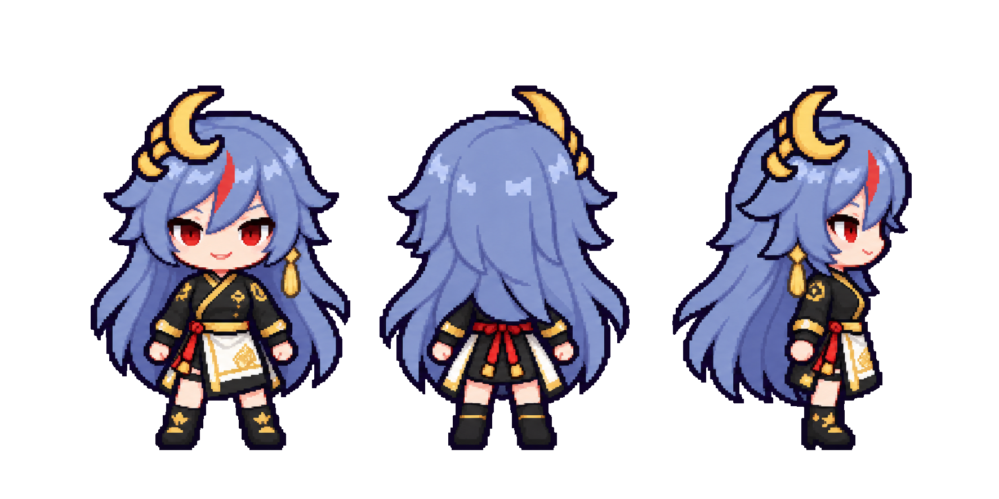
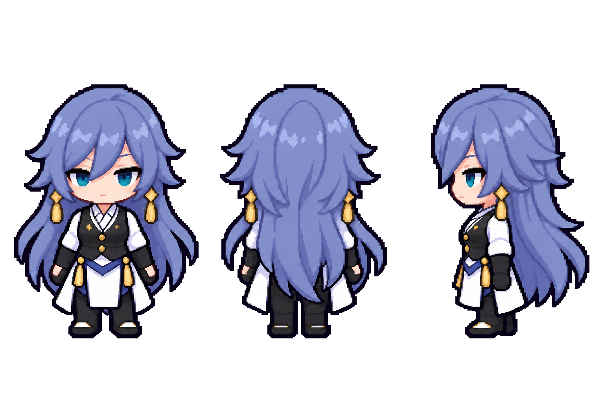
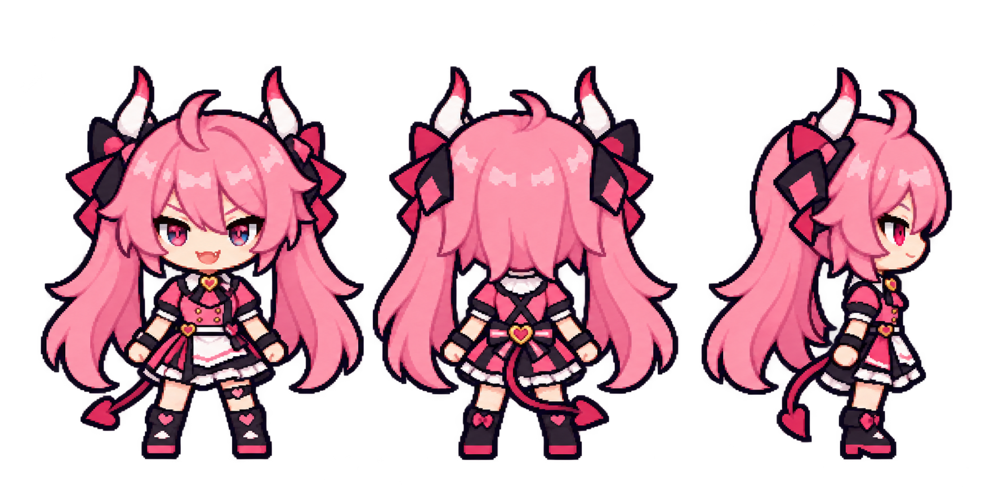

# Bếp Lửa Thái Hư V3 — Model sheet chờ duyệt

> Trạng thái: **CHỜ DUYỆT**. Chưa tạo bất kỳ dải animation nào.

## Senti

- Ba góc: mặt / lưng / nghiêng phải, cùng đường chân.
- Khóa nhận diện: tóc xanh lam nhạt dài, lọn mái đỏ, mắt đỏ, cài tóc trăng khuyết vàng.
- Đồng phục: áo đen viền vàng, tạp dề trắng viền vàng, dây lưng đỏ.

## Fu Hua

- Ba góc: mặt / lưng / nghiêng phải, cùng đường chân.
- Khóa nhận diện: tóc xanh tím dài, mắt xanh ngọc, khuyên tai tua vàng, nét mặt nghiêm.
- Đồng phục: sơ mi trắng, gilê đen nút vàng, các vạt tạp dề trắng.

## Rozaliya

- Tóc hồng hai đuôi, cặp sừng, đuôi và biểu cảm tăng động giữ vai trò nhận diện.
- Đồng phục lễ tân/idol hồng–đen–trắng, không cầm đạo cụ trong model sheet.

## Liliya

- Tóc xanh băng, sừng xanh đậm, mắt tím xanh, đuôi và biểu cảm buồn ngủ.
- Đồng phục phục vụ xanh–đen–trắng, không cầm khay trong model sheet.

## Thông số chung đã áp dụng

- Pixel chibi 2,3 đầu, đọc được khi thu về ô 48×64 px.
- Top-down 3/4, không isometric, không render 3D, không viền sticker trắng.
- Viền tím than; màu phẳng; ánh sáng từ trên trái.
- Nền PNG trong suốt; alpha đã ép về đúng 0/255.
- Đây là model sheet duyệt tạo hình, chưa phải sprite sheet 192×576.

## Prompt đã dùng

### Senti

Model sheet pixel chibi cho Senti, đúng ảnh chuẩn đính kèm; chính xác ba tư thế toàn thân mặt/lưng/nghiêng phải trên cùng baseline; tóc xanh lam nhạt dài, lọn mái đỏ, mắt đỏ, cài tóc trăng khuyết vàng; áo quán đen viền vàng, tạp dề trắng viền vàng, dây lưng đỏ; top-down 3/4 RPG; viền tím than 1 px, tối đa 24 màu, nền trong suốt; không chữ, không đạo cụ, không action, không 3D, không glow, không viền trắng.

### Fu Hua

Model sheet pixel chibi cho Fu Hua, đúng ảnh chuẩn đính kèm; chính xác ba tư thế toàn thân mặt/lưng/nghiêng phải trên cùng baseline; tóc xanh tím dài, mắt xanh ngọc, khuyên tai tua vàng, nét mặt nghiêm; sơ mi trắng, gilê đen nút vàng, vạt tạp dề trắng; top-down 3/4 RPG; viền tím than 1 px, tối đa 24 màu, nền trong suốt; không chữ, không đạo cụ, không action, không 3D, không glow, không viền trắng.

### Rozaliya

Model sheet pixel chibi cho Rozaliya Olenyeva / Molotov Cherry; chính xác ba góc mặt/lưng/nghiêng phải; khóa tóc hồng hai đuôi, cặp sừng, đuôi, mắt và biểu cảm tăng động; đồng phục lễ tân hồng dựa trên bảng màu HI3; cùng tỉ lệ và nét với Senti; nền trong suốt; không chữ, đạo cụ, 3D hay sticker.

### Liliya

Model sheet pixel chibi cho Liliya Olenyeva / Blueberry Blitz; chính xác ba góc mặt/lưng/nghiêng phải; khóa tóc xanh băng, sừng xanh đậm, đuôi, mắt tím xanh và biểu cảm buồn ngủ; đồng phục phục vụ xanh dựa trên bảng màu HI3; cùng tỉ lệ và nét với Senti; nền trong suốt; không chữ, đạo cụ, 3D hay sticker.

## Cần duyệt trước khi đi tiếp

1. Khuôn mặt và độ dài tóc đã đúng Senti / Fu Hua chưa?
2. Cài tóc trăng khuyết của Senti và khuyên tai Fu Hua đã đủ rõ ở kích thước chibi chưa?
3. Đồng phục đen–trắng–vàng có giữ hay cần giảm chi tiết trước khi thu về 48×64?
4. Tỉ lệ đầu/thân hiện tại có vừa với nhân vật trong cảnh Rush không?

Sau khi được duyệt mới tạo từng dải 4 frame: `idle_down`, `walk_down`, `walk_up`, `walk_right`, `work_a`, `work_b`, `emote`, `rest`, `held_doze` và sheet phụ.
