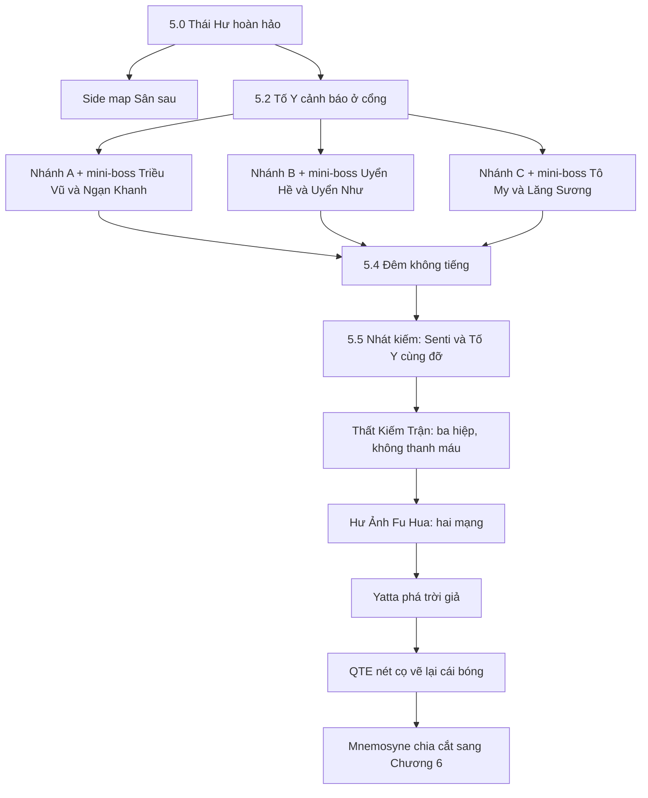

# CHƯƠNG 5 — NGƯỜI KHÔNG CÓ KHUYẾT ĐIỂM
## Cấu trúc, lore, side map và boss Cinematic V3

> Trạng thái: **BẢN V3 ĐÃ CHỐT CẤU TRÚC — CHƯA ĐƯA VÀO GAME**  
> Bản này thay cấu trúc “ba nhánh ký ức + bảy boss lẻ” của review pack cũ. Chương 5 giữ chiều sâu tâm lý nhưng giảm combat fatigue bằng cách gộp ký ức và trận đánh.

## 1. Câu chủ đề

Bản chất của một người thầy không nằm ở việc tạo ra những học trò giống nhau, luôn nghe lời và không bao giờ phạm sai lầm. **Thái Hư Hoàn Hảo** là một lớp học đã chết: không ai đặt câu hỏi, không ai lớn lên và mọi vết nhăn của sự trưởng thành đều bị Mnemosyne ủi phẳng.

Fu Hua chiến thắng khi cô chấp nhận hai điều:

1. Học trò của cô có quyền sai, hối hận và bước tiếp mà không cần một lời tha thứ giả.
2. Cô cũng có quyền là một người hướng dẫn không hoàn hảo, thay vì tự biến mình thành quy tắc “Nhập ma tất tru”.

Senti không sửa lịch sử. Cô ngăn Mnemosyne sử dụng lịch sử như công cụ tra tấn và buộc một sự sống đang tiếp diễn phải phục tùng quá khứ.

## 2. Cấu trúc tinh gọn đã chốt

Toàn chương chỉ còn năm khối chiến đấu lớn:

1. Mini-boss Nhánh A.
2. Mini-boss Nhánh B.
3. Mini-boss Nhánh C.
4. Thất Kiếm Trận ba hiệp.
5. Hư Ảnh Fu Hua hai mạng.

Tần Tố Y không có lượt boss riêng. Cô là người cảnh báo, người cố cứu sư phụ và người dùng Mặc Nhiễm Hương khép lại quá khứ.

---

## 3. Tuyến truyện chính

### 5.0 — Người không có khuyết điểm

Mnemosyne dựng một Thái Hư sạch đến vô lý. Sân không bụi, chuông ngân đúng nhịp, bảy đệ tử cúi chào cùng một góc. Trước Phất Vân Quán, bia “Nhập ma tất tru” mới tinh như chưa từng có ai phải trả giá vì nó.

Senti nhận ra Fu Hua của ký ức không có bóng và mép trời mang nét bút.

> **Senti:** “Thái Hư sạch đến mức đáng ngờ. Không bụi, không ai cãi nhau, không ai làm đổ trà.”
>
> **Fu Hua:** “Ký ức thường giữ lại điều người ta muốn tin.”
>
> **Senti:** “Vậy thứ này không phải ký ức. Nó là lời bào chữa.”

### 5.1 — Sân sau không nằm trong bức tranh

Cánh cửa gỗ lệch bản lề dẫn tới sân sau, nơi Fu Hua từng quét sân, gánh nước, sửa cọc và uống trà một mình. Khu vực này trở thành side map quay lại được giữa các đoạn chính.

Sau cột hiên có bảy hàng vạch đo chiều cao. Hàng thấp nhất ghi “Triều Vũ — sáu tuổi”.

> **Senti:** “Cô đo cho cả bảy người. Còn ai đo cho cô?”
>
> **Fu Hua:** “Ta không cao thêm nữa.”
>
> **Senti:** “Ta không hỏi chuyện đó.”

### 5.2 — Cổng núi phủ tro

Tần Tố Y đứng ở cổng với Mặc Nhiễm Hương. Mỗi lần cô sắp nói ra kế hoạch phản bội, Mnemosyne tua cảnh về đầu. Đầu bút sau mỗi lần tua lại càng ướt mực.

> **Tần Tố Y:** “Sư phụ... xin người đừng lên núi.”
>
> **Tần Tố Y:** “Đêm nay, xin người đừng ở lại Phất Vân Quán. Bọn con—”

Senti nhặt được câu hỏi:

> “Sáu người kiếm là binh khí. Riêng thất muội cầm một cây bút. Người có biết vì sao không?”

## 4. Ba nhánh ký ức đồng thời là ba trận mini-boss

### Nhánh A — Bóng Tối Phản Bội

Nhân vật: **Lâm Triều Vũ và Mã Ngạn Khanh**.

Triều Vũ kể việc sáu tuổi đi sau Xích Diên ngay sau khi cha mẹ bị trừ. Cô không khóc vì sợ nếu tỏ ra yếu đuối sẽ bị bỏ lại. Ngạn Khanh thú nhận mình đã đi theo người dám quyết định, rồi chỉ đặt câu hỏi sau khi rút kiếm.

**Sân đấu:** chỉ một vòng sáng nhỏ quanh Senti; ngoài vòng là màu đen tuyệt đối.

**Chu kỳ giải trận:**

1. Triều Vũ lao vào bằng ba nhịp kiếm Khinh Trần Liễu.
2. Parry đúng cả ba nhịp làm vòng sáng mở rộng.
3. Ánh sáng lộ bóng Ngạn Khanh đang gồng Cự Kiếm Đỏ ở góc khuất.
4. Đổi sang Thương, lao tới phá giáp trước khi hắn biến mất.
5. Lặp hai chu kỳ để kết thúc trận.

Đánh loạn vào Triều Vũ làm đèn tắt; đuổi Ngạn Khanh vào bóng tối khiến người chơi bị phản kích. Trận dạy người chơi giữ bình tĩnh và soi điều mình không muốn nhìn.

Vật chứng: **Mảnh Xích Tuyệt Ảnh**.

### Nhánh B — Sự Im Lặng Của Căn Bệnh

Nhân vật: **Giang Uyển Hề và Giang Uyển Như**.

Uyển Như bị Honkai xâm thực nhưng vẫn muốn sống. Uyển Hề chống lại luật sư môn để bảo vệ em. Toàn bộ nhạc, tiếng vũ khí và cue cảnh báo bị cắt.

**Luật trận:** không được gây sát thương cho Uyển Như.

- Uyển Như đứng trên tầng cao và bắn tên tàng hình; chỉ bóng dưới đất xuất hiện 0,5 giây trước điểm rơi.
- Chém trúng cô gây phản sát thương lớn lên Senti.
- Người chơi đọc bụi, bóng và vết nứt để né.
- Uyển Hề được Chuông Hộ Thân bảo vệ trong vùng an toàn.
- Dùng Xích móc chiếc chuông, kéo Uyển Hề ra rồi phá thế thủ của cô.

Hạ Uyển Hề kết thúc trận; Uyển Như không bị đánh bại bằng bạo lực.

> **Giang Uyển Như:** “Con muốn sống. Chỉ vậy thôi. Như thế là sai sao?”
>
> **Fu Hua:** “Không sai. Ta đã nhìn căn bệnh trước khi nhìn con.”

Vật chứng: **Dải Băng Của Uyển Như**.

### Nhánh C — Tuyệt Đối Học Hỏi

Nhân vật: **Tô My và Trình Lăng Sương**.

Tô My dựng ba ấn. Mỗi ấn chỉ mở khi Fu Hua đứng nghe hết một lời buộc tội. Trong lúc đó, Lăng Sương chém khí kiếm từ xa và ghi nhớ từng thao tác của Senti.

**Cơ chế chống spam:**

- Dùng cùng vũ khí hai lần liên tiếp khiến Lăng Sương né rồi phản chí mạng.
- Người chơi phải đổi vòng `Kiếm → Thương → Xích → Kiếm` để làm rối mô hình dự đoán.
- Mỗi chuỗi ba vũ khí đúng nhịp làm lộ một ấn của Tô My.
- Phá đủ ba ấn mới kéo Lăng Sương vào trận trực diện.

Khi còn 30% HP, kiếm vật lý của Lăng Sương vỡ và cô dùng Thái Hư Kiếm Thần phủ AOE toàn màn hình. Game không đưa nút tấn công mà hiện QTE ẩn:

> **THU VŨ KHÍ**

Senti tra kiếm vào vỏ và đứng yên. Lăng Sương khựng lại, nhớ bài học “kiếm đủ nhanh rồi thì phải học cách dừng”, sau đó chấp nhận thua.

> **Fu Hua:** “Bây giờ ta biết không do dự cũng là một lựa chọn.”

Vật chứng: **Chuông Câm**.

## 5. Đêm không tiếng và nhát kiếm đã xảy ra

### 5.4 — Đêm không tiếng

Ba vật chứng mở sân chính. Uyển Hề cắt âm thanh, Ngạn Khanh dập đèn và Tô My khóa cửa. Người chơi dùng các bài học của ba nhánh để đi xuyên đêm phản bội mà không có thêm trận boss máu dài.

### 5.5 — Senti và Tố Y cùng bước khỏi kịch bản

Lần đầu, ký ức diễn đúng lịch sử: Lăng Sương tung nhát kiếm chí mạng và Fu Hua gục xuống. Mnemosyne tua lại để bắt cô xem lần nữa.

Lần thứ hai, Senti dùng Xích giữ tay Lăng Sương. Tần Tố Y cũng phá vị trí Mnemosyne đã đặt cho mình, lao ra dùng bút chặn đường kiếm còn lại. Hai người cùng đỡ nhát kiếm.

> **Senti:** “Old Timer, cô không cần bước tiếp chỉ vì ký ức ra lệnh.”
>
> **Tần Tố Y:** “Lần trước con chậm một bước. Lần này... xin cho con tới kịp.”
>
> **Fu Hua:** “Ta nghe thấy rồi.”

Họ không thay đổi lịch sử thật. Hành động này chỉ tước khỏi Mnemosyne quyền bắt Fu Hua chết thêm một lần.

Mnemosyne đốt Phất Vân Quán. Senti và Tố Y cõng Fu Hua của ký ức ra khỏi lửa; Fu Hua hiện tại đi theo sau và nhìn thấy người đã cứu mình.

---

## 6. Side map Sân Sau — Bảng Việc Vặt

SS1 riêng bị hủy. Toàn bộ cảm xúc **Sân Sau Không Còn Yên Tĩnh** được chuyển thành payoff của việc hoàn thành đủ mười việc.

### Mười việc

| Đợt | Việc | Gameplay và dấu vết để lại |
|---|---|---|
| 1 | **Quét lá** | Đọc chu kỳ gió; hoàn thành trải chiếu ở hiên |
| 1 | **Gánh nước** | Dùng Xích kéo gàu và giữ thăng bằng; chum đầy nước |
| 1 | **Sửa cọc tập** | Giữ lực Xích đúng vùng; cọc được dựng thẳng |
| 1 | **Chẻ củi** | Dùng Thương đâm theo thớ; củi được xếp cạnh bếp |
| 2 | **Phơi chăn** | Quăng Xích theo hướng gió; chăn bay trên sào |
| 2 | **Vườn rau và trà** | Kiếm cắt cỏ, hái lá trà và hoa cúc; vườn xanh lại |
| 2 | **Mèo hoang** | Đặt cá rồi nhả toàn bộ nút năm giây; mèo nằm ở hiên |
| 3 | **Đánh chuông chiều** | Gõ nhịp lệch của Fu Hua: chậm – nhanh – chậm; chim trở lại mái |
| 3 | **Vá mái hiên** | Đu Xích lên mái, đặt bốn viên ngói; sân có bóng râm |
| 3 | **Pha trà** | Dùng nước, củi và trà đã thu từ các việc trước |

### Pha trà năm bước

1. Múc nước từ chum.
2. Nhóm bếp bằng củi đã chẻ.
3. Chọn trà xanh, trà cúc hoặc trà lá rụng.
4. Canh nhiệt.
5. Rót hai chén đầy đều.

Kết quả nào Fu Hua cũng uống. Sau khi rót xong, cutscene hoàn thành tự động chạy:

1. Camera lướt qua cọc đã sửa.
2. Chăn bay nhẹ trong gió.
3. Mèo cuộn mình ở hiên.
4. Chuông ngân nhịp không hoàn hảo.
5. Hai người ngồi cạnh hai chén trà.

> **Fu Hua:** “Sân này... hình như không còn yên tĩnh như trước.”
>
> **Senti:** “Cô nói như thể đó là chuyện xấu.”
>
> **Fu Hua:** “Không. Không phải chuyện xấu.”

Fu Hua viết thêm lên bảng:

> **“Ngày mai: uống trà với Senti.”**

Senti quay mặt đi và không nói. Cutscene trao kỷ vật **Hai Chén Trà** cùng thẻ Album **Sân Sau Không Còn Yên Tĩnh**.

## 7. Bốn side story còn lại

### Bát Gỗ Thứ Tám

Fu Hua nấu cháo cho bảy đứa trẻ nhưng chưa bao giờ đặt bát của mình lên bàn. Senti khắc mặt cười méo lên chiếc bát trơn thứ tám và buộc cô ngồi xuống ăn.

Kỷ vật **Bát Gỗ Thứ Tám** thêm khung tám chiếc bát khi Thất Kiếm Trận kết thúc.

### Trốn Tìm Không Dấu Chân

Uyển Hề tìm Uyển Như bằng tiếng cười trên sân tuyết không có dấu chân. Khi ký ức tan, tuyết biến thành tro.

Kỷ vật **Khăn Bịt Mắt** giữ lại một tiếng cười nhỏ trong Hiệp 2 im lặng của Thất Kiếm Trận.

### Bức Tranh Thiếu Một Gương Mặt

Tần Tố Y vẽ đủ bảy người nhưng bỏ trống mặt Fu Hua vì sư phụ chưa bao giờ cười đủ lâu. Senti vẽ một khuôn mặt nguệch ngoạc; Fu Hua bật cười và Tố Y nói: “Kịp rồi.”

Kỷ vật **Bức Họa Tám Người** đổi hình sau khi Tố Y vẽ lại cái bóng ở cuối chương.

### Kiếm Dưới Trăng

Lăng Sương mười ba tuổi luyện kiếm một mình. Người chơi chỉ kết thúc đấu tập bằng cách thu vũ khí và ngồi xuống ngắm trăng, dạy trước cơ chế QTE ở Nhánh C.

Kỷ vật **Vỏ Kiếm Trống** mở câu thoại riêng khi Lăng Sương thu kiếm.

---

## 8. Thất Kiếm Trận — thanh Bẻ Gãy Trận Pháp

Trận không có HP boss. Ba hiệp lấp dần thanh **BẺ GÃY TRẬN PHÁP**.

### Hiệp 1 — Cuồng Phong

- Bảy người lần lượt lướt qua với telegraph đan chéo.
- Người chơi bị khóa tấn công, chỉ có Dash.
- Né sáu nhát đầu.
- Ở nhát thứ bảy của Triều Vũ, Parry lóe đúng một nhịp.
- Phản thành công làm cả đội hình xô lệch và mở một phần thanh trận pháp.

### Hiệp 2 — Mù Lòa

- Sân chìm trong bóng tối và mất âm thanh.
- Fu Hua đứng ngoài rìa, chỉ tay về từng hướng.
- Hướng cô chỉ lóe sáng đúng một giây.
- Senti dùng Thương đâm theo dấu tay để phá các mắt xích tàng hình.
- Có **Khăn Bịt Mắt** thì tiếng cười Uyển Như vang rất nhỏ như một cue phụ.

### Hiệp 3 — Buông Bỏ

- Bảy lời oán hận ngưng thành Lõi Ký Ức bị xích gông cùm quấn quanh.
- Senti dùng Xích giữ lõi để nó không tự nổ.
- Người chơi kéo lõi tới bằng QTE bấm liên tục hoặc giữ nút theo tùy chọn hỗ trợ.
- Khi thanh đầy, gọi Fu Hua Assist.
- Edge of Taixuan không chém các đồ đệ hay phá lõi. Nó chém đứt những sợi xích đang tự trói họ trong dằn vặt.

Trận pháp tan trong im lặng. Bảy người hạ vũ khí.

> **Senti:** “Họ oán chính họ. Cô định gánh luôn cả phần đó à?”
>
> **Fu Hua:** “Ta không thể sửa điều đã xảy ra.”
>
> **Tô My:** “Vậy người vẫn muốn chúng con tha thứ sao?”
>
> **Fu Hua:** “Không. Ta chỉ muốn ngừng dùng nỗi đau của các con để trừng phạt chính mình.”

Đây là bài học cuối Fu Hua trao cho họ: không phải trừng phạt bằng “Nhập ma tất tru”, mà là tự do bước tiếp.

## 9. Boss cuối — Hư Ảnh Fu Hua

Hư Ảnh đánh như một chương trình không có cảm xúc. Toàn bộ vũ khí sao chép và viền đòn đánh dùng **xám trắng**, đối lập đỏ mực của Senti và vàng cam của Fu Hua.

### Mạng 1 — Trừng Phạt Sai Lầm

Boss có ba thế thủ:

| Thế | Cách giải đúng | Trừng phạt dùng sai |
|---|---|---|
| **Cứng** | Thương phá giáp | Phản đòn không thể né, mất lượng HP lớn |
| **Mềm** | Kiếm parry Quyền kình | Bắt nhịp chém và quật ngã |
| **Xa** | Xích khóa khoảng cách | Phản kích từ ngoài tầm nhìn |

Boss đánh chậm, telegraph rõ, nhưng sai một cơ chế bị phạt nặng. Đây là kỷ luật thép của người sư phụ “không cho phép sai”.

Khi hết mạng một, Hư Ảnh vẫn đứng dậy.

> **Senti:** “Cái gì? Nó vẫn còn đứng dậy được sao?”
>
> **Fu Hua:** “Để ta giúp ngươi.”
>
> **Hư Ảnh:** “Nó sinh ra từ ký ức của ngươi. Nó cũng chỉ là một cái bóng.”
>
> **Fu Hua:** “Ta chọn người đang đứng cạnh ta.”

Nếu có **Hai Chén Trà**:

> **Hư Ảnh:** “Thái Hư không có chỗ cho chén trà thứ hai.”
>
> **Fu Hua:** “Có. Ta vừa rót.”

### Mạng 2 — Cái Bóng Vô Hồn

#### Tẩy Màu

- Mỗi đòn boss đánh trúng rút một tầng saturation khỏi toàn bộ hình ảnh và UI.
- Trúng ba đòn liên tiếp biến màn hình thành xám trắng vô trùng.
- Đòn sạch hoặc Assist đúng nhịp trả lại một phần màu.
- Dual Combo hoàn chỉnh bơm màu đỏ mực và vàng cam trở lại ở mức bùng nổ, tượng trưng hơi ấm của sự sống phá hệ thống hoàn hảo.

#### Đòn Kết Thúc Giả

Boss lùi lại, cảnh báo đỏ dụ người chơi né. Né sớm làm animation né kết thúc đúng lúc đòn thật rơi xuống.

- Người chơi phải chờ 0,5 giây sau cảnh báo mới dash.
- Nếu bị bắt roll, màn hình chuyển màu âm bản và phát tiếng kính thủng.
- Sau lần đầu trúng, Fu Hua gọi “Khoan” đúng trước nhịp thật để dạy cơ chế mà không dùng popup dài.

#### Delay Combo

Boss dự đoán chuỗi hoàn hảo nhưng không hiểu nhịp cố ý vụng:

1. Đánh một hit.
2. Dừng 0,2 giây.
3. Đánh hit thứ hai.
4. Đổi vũ khí ở hit thứ ba.

Nhịp trễ làm AI khựng và mở cửa sổ sát thương. Hư Ảnh sao chép được từng vũ khí nhưng không sao chép được sự ứng biến giữa hai người.

### Dual Combo và Yatta phá thực tại

Khi đủ ba lần phá thế, nút Dual Combo sáng rực. Senti và Fu Hua lao vào từ hai phía. Màu đỏ mực và vàng cam tràn ngược qua toàn bộ màn hình, đẩy saturation lên rực hơn bình thường rồi ổn định lại.

Hư Ảnh gục. Thái Hư giả cố tự vá, làm nhân vật, lá cây và chuông đứng yên như ảnh đông cứng.

Senti không dùng vũ khí. Cô vươn vai và hét:

> **“YATTA!”**

Sóng âm của niềm vui thuần túy tạo dư chấn vật lý. Bầu trời Thái Hư Hoàn Hảo nứt thành hàng vạn mảnh kính. Niềm vui lộn xộn phá nát sự hoàn hảo chết.

## 10. QTE kết chương — Nét cọ của sự thừa nhận

Một giọt mực rơi khỏi bầu trời vỡ. Game trao điều khiển cho Senti:

1. Đi tới và nhặt giọt mực.
2. Giữ nút để nó không tan trong tay.
3. Chạm giọt mực vào đầu bút Mặc Nhiễm Hương của Tố Y.

Tố Y vẽ một nét đen dưới chân Fu Hua. Cái bóng loang ra, không hoàn hảo, rung theo gió nhưng bám chắc vào mặt đất thật.

> **Tần Tố Y:** “Sở kiến phi chân. Nhưng cái bóng này là thật, sư phụ.”
>
> **Fu Hua:** “Tố Y... hai mươi năm sau, ta—”
>
> **Tần Tố Y:** “Đó là chuyện của hai mươi năm sau. Hôm nay người chỉ cần nghe con nói hết.”
>
> **Tần Tố Y:** “Con nói hết rồi.”

Nét cọ khép cánh cửa quá khứ. Ngay sau đó Mnemosyne xé đôi màn hình, cắt Xích Nhận và kéo hai người vào Chương 6.

---

## 11. Các chi tiết fan-game đã được duyệt

| Chi tiết | Trạng thái |
|---|---|
| Trình Lăng Sương tung nhát kiếm chí mạng | **Đã duyệt** |
| Uyển Hề dùng thương, Uyển Như dùng cung để đa dạng gameplay | **Đã duyệt** |
| Bảy câu chuyển lượt dựa trên “bảy nỗi khổ” | **Đã duyệt** |
| Tần Tố Y vẽ Thái Hư Hoàn Hảo và vẽ lại cái bóng | **Đã duyệt** |
| Bốn side story đời thường cùng Bảng Việc Vặt | **Đã duyệt** |
| Hư Ảnh không thể dùng Dual Combo vì cô độc | **Đã duyệt** |

Những điểm này là continuity chính thức của fan-game từ bản V3, không tiếp tục xem là mục chờ quyết định.

## 12. Asset và hiệu ứng cần cho bản V3

### Ba mini-boss

- Vòng sáng co giãn, bóng tối tuyệt đối và Cự Kiếm Đỏ của Ngạn Khanh.
- Bóng tên không vệt, bụi báo điểm rơi và Chuông Hộ Thân của Uyển Hề.
- Ba ấn của Tô My, khí kiếm AOE và QTE `THU VŨ KHÍ`.

### Thất Kiếm Trận

- Thanh `BẺ GÃY TRẬN PHÁP`.
- Bảy telegraph Cuồng Phong.
- Pose Fu Hua chỉ hướng trong màn tối.
- Lõi Ký Ức, xích gông cùm và Edge of Taixuan hóa giải.

### Hư Ảnh Fu Hua

- Ba thế thủ Cứng/Mềm/Xa.
- Bộ Kiếm, Thương, Xích xám trắng.
- Sáu mức tẩy saturation và hiệu ứng trả màu đỏ/vàng.
- Flash âm bản khi người chơi né sớm.
- Animation Delay Combo làm AI khựng.
- Dual Combo trả màu và sóng âm Yatta phá trời kính.

### Kết chương

- Giọt mực có thể nhặt.
- QTE chạm mực vào bút.
- Cái bóng Fu Hua được vẽ từ một nét loang không hoàn hảo.
- Chuyển cảnh màn hình bị xé nối đúng với mở đầu Chương 6 V3.

## 13. Nhịp cảm xúc sau khi tinh gọn

- Ba nhánh vừa kể chuyện vừa đánh boss, nên mỗi trận đều có lý do cảm xúc.
- Side map tạo khoảng thở và trả công bằng cutscene thay vì thêm một side story trùng nội dung.
- Thất Kiếm Trận là bài kiểm tra cơ chế, không phải thêm một thanh máu dài.
- Hư Ảnh vẫn là cao trào duy nhất có hai mạng đầy đủ.
- Tố Y không bị biến thành một boss phải đánh bại; cô hoàn tất vai trò người cố đến kịp và người trả lại cái bóng cho sư phụ.
- Cú Yatta đưa niềm vui của Senti thành sức mạnh phá sự hoàn hảo, rồi QTE nét cọ khép chương bằng một hành động nhỏ và yên tĩnh.
