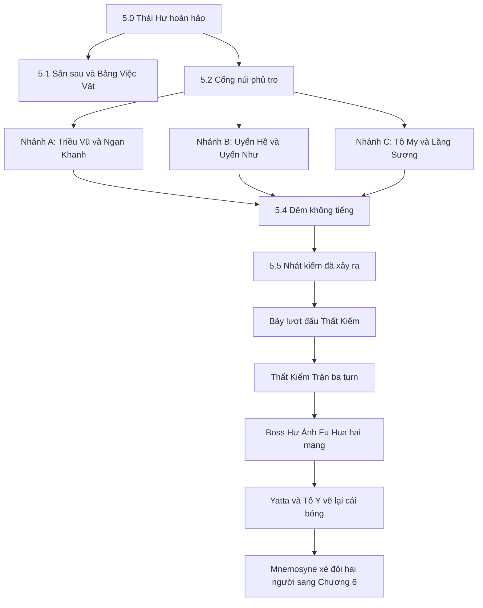

# CHƯƠNG 5 — NGƯỜI KHÔNG CÓ KHUYẾT ĐIỂM
## Lore, side story và side map hiện tại để duyệt

> Trạng thái: **BẢN LƯU TRƯỚC KHI TINH GỌN — ĐÃ ĐƯỢC THAY THẾ**  
> Cấu trúc Chương 5 mới nhất nằm trong `CH5-CINEMATIC-V3-DE-DUYET.md`.
> Nguồn ưu tiên: `specs/REVIEW-PACK-CH5-ALBUM-v2.md`. File `CHAPTER-4-5.md` chỉ là bản tóm tắt cũ và không còn đủ năm side story cùng Bảng Việc Vặt.

## 1. Ý chính của Chương 5

Mnemosyne không bắt Fu Hua quên quá khứ. Nó dựng một quá khứ **hoàn hảo**, nơi không ai phạm sai lầm, không ai phản bội và Fu Hua luôn là người sư phụ đúng đắn tuyệt đối.

Chương 5 phản bác sự hoàn hảo đó theo ba bước:

1. Fu Hua nghe những điều bảy đệ tử đã không thể nói trong đêm phản bội.
2. Cô không tha thứ thay họ và cũng không bắt họ tha thứ cho mình.
3. Cô từ chối tiếp tục dùng nỗi đau của họ để trừng phạt bản thân.

Senti không sửa lịch sử cho Fu Hua. Cô đứng cạnh, ngăn Mnemosyne ép Fu Hua chết lại trong cùng một ký ức và bảo vệ quyền được nhớ quá khứ như nó đã thật sự xảy ra.

## 2. Sơ đồ toàn chương

Sân sau là hub phụ. Người chơi quay lại giữa các đoạn chính để mở thêm việc vặt và side story.

---

## 3. Tuyến truyện chính

### 5.0 — Người không có khuyết điểm

Mnemosyne dựng Thái Hư sạch đến vô lý. Sân không bụi, chuông ngân đúng nhịp, bảy đệ tử cúi đầu cùng một góc và cười giống nhau. Bia đá trước Phất Vân Quán ghi **“Nhập ma tất tru”**, mới tinh như chưa từng trải qua thời gian.

Senti phát hiện hai lỗi:

- Mọi người đều có bóng, riêng Fu Hua không có.
- Mép trời có vết bút, cho thấy cảnh vật đang được ai đó vẽ lại.

> **Senti:** “Thái Hư sạch đến mức đáng ngờ. Không bụi, không ai cãi nhau, không ai làm đổ trà.”
>
> **Fu Hua:** “Ký ức thường giữ lại điều người ta muốn tin.”
>
> **Senti:** “Vậy thứ này không phải ký ức. Nó là lời bào chữa.”

Senti thú nhận khi mới tỉnh dậy trong cơ thể Fu Hua, cô từng tưởng những ký ức Thái Hư là của mình. Cô nhớ mùi khói, tiếng chuông và đêm phản bội như thể chính mình từng sống qua, nhưng chưa bao giờ thấy một Thái Hư sạch sẽ như bản này.

### 5.1 — Cửa phụ dẫn tới sân sau

Một cánh cửa lệch bản lề không tồn tại trong bản đồ hoàn hảo dẫn tới sân sau. Đây là nơi Fu Hua từng quét sân, gánh nước, sửa cọc và pha trà một mình.

Khu vực không có quái và không mất máu. Nó là khoảng nghỉ giữa những ký ức nặng, đồng thời chứng minh cuộc sống Thái Hư từng gồm các việc nhỏ chứ không chỉ có phản bội và kiếm pháp.

Bí mật sau cột hiên là bảy hàng vạch đo chiều cao. Hàng thấp nhất ghi **“Triều Vũ — sáu tuổi”**.

> **Senti:** “Cô đo chiều cao cho cả bảy người. Còn ai đo cho cô?”
>
> **Fu Hua:** “Ta không cao thêm nữa.”
>
> **Senti:** “Ta không hỏi chuyện đó.”

### 5.2 — Cổng núi phủ tro

Màu của Thái Hư Hoàn Hảo bong dần. Tần Tố Y đứng ở cổng với Mặc Nhiễm Hương và cầu xin Fu Hua đừng lên núi. Mỗi lần cô định nói lý do, Mnemosyne tua cảnh về đầu. Sau mỗi lần tua, đầu bút của Tố Y lại ướt mực hơn.

> **Tần Tố Y:** “Sư phụ… xin người đừng lên núi.”
>
> **Fu Hua:** “Tố Y, con muốn cảnh báo ta điều gì?”
>
> **Tần Tố Y:** “Đêm nay, xin người đừng ở lại Phất Vân Quán. Bọn con—”

Cảnh bị kéo ngược. Senti nhặt được mảnh giấy:

> “Sáu người kiếm là binh khí. Riêng thất muội cầm một cây bút. Người có biết vì sao không?”

Câu hỏi chỉ được trả lời sau lượt đấu Tần Tố Y.

### 5.3 — Ba nhánh ký ức

#### Nhánh A — Đèn tắt

Nhân vật: **Lâm Triều Vũ và Mã Ngạn Khanh**.

Ký ức quay về đêm tà tế năm 1446. Triều Vũ sáu tuổi cầm đèn đi sau Xích Diên, ngay sau khi Fu Hua vừa trừ cha mẹ cô bé. Người chơi phải giữ ba ngọn đèn qua gió; ánh đèn là cách duy nhất soi ra thân thật của Mã Ngạn Khanh giữa các phân thân gương.

> **Lâm Triều Vũ:** “Con lớn lên như thế đó: sợ bị bỏ lại hơn sợ chết.”
>
> **Mã Ngạn Khanh:** “Ta có hỏi. Chỉ là hỏi sau khi đã rút kiếm.”

Vật chứng: **Mảnh Xích Tuyệt Ảnh**.

#### Nhánh B — Tử sĩ hóa

Nhân vật: **Giang Uyển Hề và Giang Uyển Như**.

Uyển Hề mang thuốc qua vùng Băng Hoại để cứu em. Phong Thanh Dương lấy toàn bộ âm thanh của phân đoạn; người chơi phải đọc khe nứt bằng ánh sáng và bụi, bảo vệ thuốc và tuyệt đối không tấn công Uyển Như.

> **Giang Uyển Như:** “Con muốn sống. Chỉ vậy thôi. Như thế là sai sao?”
>
> **Fu Hua:** “Không sai. Ta đã nhìn căn bệnh trước khi nhìn con.”

Vật chứng: **Dải Băng Của Uyển Như**.

#### Nhánh C — Câu hỏi không được trả lời

Nhân vật: **Tô My và Trình Lăng Sương**.

Tô My khóa căn phòng bằng ba ấn. Mỗi ấn chỉ mở khi Fu Hua đứng yên và nghe hết một lời buộc tội. Trình Lăng Sương quan sát bên ngoài, học lại nhịp phản công của người chơi.

Tô My không đơn giản căm ghét sư phụ. Cô hiểu luật “nhập ma tất tru” quá rõ nên không thể ghét một người chỉ đang làm đúng điều luật ấy. Điều cô muốn là Fu Hua phải đau như một con người để bắt đầu biết do dự.

> **Tô My:** “Con biết người sẽ không chết. Con chỉ muốn một lần người phải đau như những người khác.”
>
> **Trình Lăng Sương:** “Đó là lần duy nhất con thắng mà không thấy vui.”
>
> **Fu Hua:** “Bây giờ ta biết không do dự cũng là một lựa chọn.”

Vật chứng: **Chuông Câm**.

### 5.4 — Đêm không tiếng

Ba vật chứng mở sân chính. Những cơ chế từ các nhánh hợp lại:

- Uyển Hề rung chuông và cắt toàn bộ âm thanh.
- Ngạn Khanh dập đèn rồi ẩn trong bóng tối.
- Tô My khóa cửa bằng trận pháp.

Người chơi phải đọc telegraph qua ánh sáng, bảo vệ Fu Hua và dùng đúng vũ khí lên ba neo: Thương phá neo cứng, Kiếm phản đòn, Xích kéo neo xa.

### 5.5 — Nhát kiếm đã xảy ra

**Lần thứ nhất:** ký ức diễn như lịch sử. Trình Lăng Sương ra kiếm, Fu Hua gục xuống và ánh vàng phóng lên trời. Mnemosyne tua lại để bắt cô xem lần nữa.

**Lần thứ hai:** Senti bước ra khỏi vị trí ký ức quy định, dùng Xích giữ tay Lăng Sương rồi đỡ kiếm. Cô không sửa lịch sử thật; cô chỉ từ chối để Mnemosyne dùng lịch sử làm công cụ tra tấn Fu Hua.

> **Senti:** “Old Timer, cô không cần bước tiếp chỉ vì ký ức ra lệnh.”
>
> **Fu Hua:** “Ta đã không nghe thấy điều các con ấy không dám nói.”
>
> **Senti:** “Cô cứ nghe đi. Nhưng đừng chết thêm lần nữa.”

Mnemosyne đốt Phất Vân Quán. Trong đoạn không có quái, Senti cùng Tần Tố Y cõng Fu Hua của ký ức ra khỏi lửa. Fu Hua hiện tại đi phía sau và lần đầu nhìn thấy ai đã mang mình ra.

> **Fu Hua:** “...Là con.”
>
> **Tần Tố Y:** “Con không ngăn được họ. Con chỉ mang người ra được thôi.”

---

## 4. Side map Sân Sau — Bảng Việc Vặt

### Cách mở và thay đổi sân

- Có 10 việc chia làm ba đợt, mở dần theo truyện chính.
- Làm hỏng chỉ phát thoại vui và cho thử lại.
- Mỗi việc để lại một thay đổi cố định: chum có nước, cọc được dựng, chăn phơi, mèo nằm ở hiên, mái có bóng râm.
- Màu sân ấm dần rất nhẹ nhưng vẫn giữ nền lạnh và mộc.
- Kiếm, Thương và Xích được dùng cho việc nhà thay vì chiến đấu.

### Đợt 1 — mở từ 5.0

| # | Việc | Cách chơi | Dấu vết để lại |
|---|---|---|---|
| 1 | **Quét lá** | Đọc cành cây để quét xuôi chiều gió; ngược gió làm lá bay lại | Chiếu ngồi được trải ở hiên |
| 2 | **Gánh nước** | Dùng Xích kéo gàu theo nhịp rồi giữ thăng bằng qua nền ướt | Chum đầy nước |
| 3 | **Sửa cọc tập** | Dùng Xích giữ lực đúng vùng để kéo cọc thẳng | Hàng cọc ngay ngắn |
| 4 | **Chẻ củi** | Dùng Thương đâm đúng đường thớ trên sáu khúc gỗ | Đống củi cạnh bếp |

Các lỗi vui gồm lá bay vào ấm trà, gàu bay lên mái, cọc xoay đổ nửa chum và Senti chẻ đôi cả thớt.

### Đợt 2 — mở sau hai trong ba nhánh 5.3

| # | Việc | Cách chơi | Dấu vết để lại |
|---|---|---|---|
| 5 | **Phơi chăn** | Dùng Xích quăng chăn lên sào theo hướng gió | Chăn trắng bay trên sân |
| 6 | **Vườn rau và trà** | Dùng Kiếm cắt cỏ, tránh cắt rau; tưới và hái trà, hoa cúc | Vườn xanh, mở trà cúc |
| 7 | **Mèo hoang sân sau** | Đặt cá rồi nhả toàn bộ nút trong năm giây | Mèo nằm phơi nắng ở hiên |

Mèo là thử thách ngược với chiến đấu: người chơi thắng bằng cách giữ Senti đứng yên.

### Đợt 3 — mở sau 5.4

| # | Việc | Cách chơi | Dấu vết để lại |
|---|---|---|---|
| 8 | **Đánh chuông chiều** | Dùng Thương gõ nhịp riêng của Fu Hua: chậm – nhanh – chậm | Chuông ngân, chim trở lại mái |
| 9 | **Vá mái hiên** | Móc Xích lên xà, giữ thăng bằng và đặt bốn viên ngói | Mái liền, tạo bóng râm |
| 10 | **Pha trà** | Năm bước dùng nước, củi và lá trà từ các việc trước | Hai chén trà trên bậc hiên |

### Pha trà năm bước

1. Lấy nước từ chum đã gánh.
2. Nhóm bếp bằng củi đã chẻ; giữ lửa trong vùng vừa.
3. Chọn trà xanh, trà cúc hoặc trà lá rụng “Gia vị Thái Hư”.
4. Canh nhiệt bằng kim chạy.
5. Rót hai chén đầy đều nhau.

Trà có thể nhạt, đậm, trào hoặc vừa. Kết quả nào Fu Hua cũng ngồi uống.

> **Fu Hua:** “Sân này… hình như không còn yên tĩnh như trước.”
>
> **Senti:** “Cô nói như thể đó là chuyện xấu.”
>
> **Fu Hua:** “...Không. Không phải chuyện xấu.”

Hoàn thành cả mười việc, Fu Hua tự viết thêm lên bảng:

> **“Ngày mai: uống trà với Senti.”**

Senti nhìn thấy, quay mặt đi và không nói. Đây là lần duy nhất trong game cô không tìm được câu đáp.

Phần thưởng: **Hai Chén Trà**, thẻ Album **Sân Sau Không Còn Yên Tĩnh**, mèo/chuông/chăn làm đồ trang trí và một câu thoại riêng ở boss cuối.

---

## 5. Năm side story — Năm ký ức không hoàn hảo

Các side story là ký ức Mnemosyne giấu vì chúng vụng về, bình thường hoặc không khớp hình ảnh “Thái Hư Hoàn Hảo”. Không có quái, không mất máu; mỗi truyện mở một kỷ vật và thẻ Album.

### SS1 — Sân Sau Không Còn Yên Tĩnh

Sáu cảnh: cửa gỗ lệch, quét sân, sửa cọc, múc nước, cột đo chiều cao và hai chén trà. Đây là tuyến truyện của toàn bộ Bảng Việc Vặt.

Kỷ vật: **Hai Chén Trà**.

### SS2 — Bát Gỗ Thứ Tám

Phù Hoa nấu cháo cho bảy đứa trẻ sau tà tế. Bảy bát khắc tên có ghi chú khẩu vị; cái bát thứ tám trơn, nằm trên kệ vì Fu Hua chưa bao giờ ngồi ăn cùng.

Senti dùng Xích khắc một mặt cười méo lên bát và bắt cô ngồi xuống.

> **Senti:** “Giờ nó có chủ rồi. Ngồi xuống ăn đi, Old Timer.”
>
> **Fu Hua:** “...Mặn.”
>
> **Senti:** “Thì ăn chậm thôi.”

Kỷ vật: **Bát Gỗ Thứ Tám**. Nếu hoàn thành, Thất Kiếm Trận có thêm khung tám cái bát xếp cùng hàng.

### SS3 — Trốn Tìm Không Dấu Chân

Uyển Hề và Uyển Như chơi trốn tìm trên tuyết khi còn nhỏ. Uyển Như không để lại dấu chân; người chơi tìm cô bằng tiếng cười. Sau đó Senti trốn nhưng để nguyên một hàng dấu chân dẫn tới chỗ mình.

Cảnh kết biến tuyết thành tro, nối sự vui vẻ ngày nhỏ với đêm Uyển Hề đi tìm em giữa Băng Hoại.

Kỷ vật: **Khăn Bịt Mắt**. Trong lượt boss im lặng, một tiếng cười nhỏ còn lại để báo hướng đòn.

### SS4 — Bức Tranh Thiếu Một Gương Mặt

Tần Tố Y vẽ tám người dưới gốc tùng nhưng bỏ trống mặt Fu Hua.

> **Tần Tố Y:** “Vì người chưa bao giờ cười đủ lâu để con kịp nhìn.”

Senti dùng mực vẽ một khuôn mặt cười nguệch ngoạc vào chỗ trống. Fu Hua bật cười rất ngắn; Tố Y của ký ức quay lại và nói: “Kịp rồi.”

Trên bàn có bản phác Thái Hư Hoàn Hảo với mực còn ướt, xác nhận Tố Y là người vẽ lớp ảo cảnh mà Mnemosyne đang sử dụng.

Kỷ vật: **Bức Họa Tám Người**.

### SS5 — Kiếm Dưới Trăng

Trình Lăng Sương mười ba tuổi luyện kiếm một mình sau khi đạt cảnh giới Thái Hư. Trong trận đấu tập không mất máu, cô học mọi thao tác của người chơi. Muốn hoàn thành, người chơi phải cất vũ khí và ngồi xuống thay vì cố thắng.

Fu Hua của ký ức lên núi, khoác áo cho cô bé và dạy: kiếm đã đủ nhanh, từ giờ phải học cách tra kiếm vào vỏ.

Ở hiện tại, Senti ngồi bệt xuống, vỗ chỗ bên cạnh và buộc Fu Hua cùng ngắm trăng ba giây không thoại.

Kỷ vật: **Vỏ Kiếm Trống**. Khi boss Lăng Sương dưới 30% HP và kiếm gãy, cô nói: “Lần này con tra vào vỏ được rồi, sư phụ.”

---

## 6. Chuỗi boss Thái Hư Thất Kiếm

Người chơi đánh bảy lượt riêng trước khi cả bảy hợp thành trận. Mỗi người có lính phụ và cơ chế phá phòng thủ riêng; chém liên tục không thể thắng.

| Lượt | Nhân vật | Trọng tâm gameplay |
|---|---|---|
| 1 | **Lâm Triều Vũ** | Phản đúng cú thứ ba để mở thế thủ; kiếm uốn quanh vật cản |
| 2 | **Tô My** | Kéo bóng giả vào ba ấn; telegraph đen/trắng và khóa nút né |
| 3 | **Giang Uyển Hề** | Sống qua lượt mất âm thanh rồi dùng Thương phá chuông hộ thân |
| 4 | **Giang Uyển Như** | Đọc điểm rơi của tên không có vệt bay; dẫm vỡ ba vùng Băng Hoại |
| 5 | **Trình Lăng Sương** | Liên tục đổi vũ khí vì cô học thao tác cuối; dưới 30% chuyển sang khí kiếm |
| 6 | **Mã Ngạn Khanh** | Giữ hai đèn sáng để thấy thân thật và phản cự kiếm đỏ |
| 7 | **Tần Tố Y** | Không được hạ sát; dùng Xích phá ba ấn rồi chạm vào cô |

Người thua hạ vũ khí, nói câu còn thiếu rồi tan thành mảnh ký ức. Họ không chết. Người chơi chỉ được hồi một phần HP giữa các lượt.

Sau lượt Tần Tố Y, câu hỏi cây bút được trả lời: Fu Hua cho cô cây bút vì biết cô không dám chém ai. Mnemosyne đã mượn khả năng “vẽ lại những gì đã mất” để tạo Thái Hư Hoàn Hảo.

## 7. Thất Kiếm Trận — ba turn

1. **Turn Kiếm — Bảy nhịp:** né sáu đòn nối tiếp, phản nhịp của Triều Vũ để lộ hai neo.
2. **Turn Thương — Không tiếng:** Uyển Hề cắt âm thanh, Uyển Như bắn mưa tên không vệt; Fu Hua báo hướng bằng dấu tay để Senti dùng Thương phá neo.
3. **Turn Xích — Lời chưa nói:** Tô My và Tố Y khóa ba ký ức; kéo ba vật chứng vào tâm rồi gọi Fu Hua Assist phá lõi.

Khi trận vỡ, bảy người hạ kiếm.

> **Senti:** “Bảy người này không oán cô, Old Timer. Họ oán chính họ. Cô định gánh luôn cả phần đó à?”
>
> **Fu Hua:** “Ta không thể sửa điều đã xảy ra.”
>
> **Tô My:** “Vậy người vẫn muốn chúng con tha thứ sao?”
>
> **Fu Hua:** “Không. Ta chỉ muốn ngừng dùng nỗi đau của các con để trừng phạt chính mình.”

## 8. Boss cuối — Hư Ảnh Fu Hua

Hư Ảnh là cái bóng Fu Hua bị thiếu từ đầu chương: người sư phụ không sai lầm, thà đốt hết ký ức còn hơn sống chung với chúng.

### Mạng 1 — Người sư phụ hoàn hảo

- Ba lớp thế thủ chỉ Thương phá được.
- Quyền kình phải phản bằng Kiếm.
- Gọi kiếm ảnh Triều Vũ và thương ảnh Uyển Hề làm lính phụ.
- Mỗi lần lộ sơ hở chỉ cho một chuỗi đánh ngắn.

### Chuyển mạng

> **Senti:** “Cái gì? Nó vẫn còn đứng dậy được sao?”
>
> **Fu Hua:** “Để ta giúp ngươi.”
>
> **Hư Ảnh:** “Nó sinh ra từ ký ức của ngươi. Nó cũng chỉ là một cái bóng.”
>
> **Fu Hua:** “Ta chọn người đang đứng cạnh ta.”

Nếu đã nhận **Hai Chén Trà**:

> **Hư Ảnh:** “Thái Hư không có chỗ cho chén trà thứ hai.”
>
> **Fu Hua:** “Có. Ta vừa rót.”

### Mạng 2 — Cái bóng không được phép sai

- Sao chép Kiếm, Thương và Xích của Senti.
- Gọi lính theo cặp; Fu Hua giữ một bên, Senti xử lý bên còn lại.
- Có đòn kết thúc giả bắt người né sớm.
- Phải phá đủ ba thế vũ khí mới mở Dual Combo kết liễu.
- Hư Ảnh sao chép được mọi kỹ năng, trừ Dual Combo, vì bên cạnh nó không có ai.

## 9. Kết chương

1. Senti thực hiện hoạt ảnh **Yatta**.
2. Tần Tố Y dùng Mặc Nhiễm Hương vẽ lại cái bóng dưới chân Fu Hua.
3. Fu Hua định nhắc chuyện hai mươi năm sau, nhưng Tố Y từ chối để một bi kịch tương lai nuốt mất lời cô vừa nói ở hiện tại.
4. Nét mực trên trời chảy xuống như mưa.
5. Mnemosyne xé Thái Hư và kéo Senti, Fu Hua về hai hướng, nối trực tiếp Chương 6.

> **Tần Tố Y:** “Sở kiến phi chân. Nhưng cái bóng này là thật, sư phụ.”
>
> **Tần Tố Y:** “Hôm nay người chỉ cần nghe con nói hết. Con nói hết rồi.”

---

## 10. Các chi tiết fan-game cần chị duyệt riêng

1. Game đang cho **Trình Lăng Sương** thực hiện nhát kiếm chí mạng. Canon không xác định ai ra đòn.
2. Sprite Uyển Hề dùng thương và Uyển Như dùng cung để dễ phân biệt gameplay, dù canon cả hai dùng Hiên Viên Kiếm.
3. Bảy câu chuyển lượt dựa trên cách cộng đồng diễn giải “bảy nỗi khổ”, không phải thoại canon.
4. Việc Tần Tố Y vẽ Thái Hư Hoàn Hảo và vẽ lại cái bóng của Fu Hua là sáng tác của fan-game.
5. Cột đo chiều cao, mảnh giấy ở cổng, Bảng Việc Vặt và năm side story là sáng tác dựa trên quan hệ canon.
6. Ý nghĩa “Hư Ảnh sao chép được mọi thứ trừ Dual Combo vì không có ai bên cạnh” là trục riêng của game.

## 11. Điểm hiện tại em thấy cần chị xem kỹ

- Tuyến chính rất sâu nhưng dài: ba nhánh ký ức, bảy lượt boss, Thất Kiếm Trận và Hư Ảnh có thể khiến Chương 5 dài hơn hẳn các chương khác.
- Side map có đủ mười việc nhưng SS1 đang kể lại một phần các việc đó; cần quyết định giữ hai lớp hay biến SS1 thành cutscene kết của Bảng Việc Vặt.
- Tần Tố Y đang giữ ba vai trò lớn: người cảnh báo, người vẽ ảo cảnh và người khép chương. Điều này cảm xúc mạnh nhưng dễ làm sáu người còn lại mờ hơn.
- Mạch Chương 7 mới đã tránh lặp lại Chương 5: C7 dùng lời xin lỗi hoàn hảo để cám dỗ Fu Hua, không bắt cô đối mặt lại cùng sự thật.
- Bản này chưa thêm lớp Cinematic V3 kiểu phá UI như Chương 1–4 và 6. Đây là nội dung hiện tại để chị duyệt trước.
