# STORY BIBLE — SENTIENCE: SHATTERED MEMORIES
### Fan-game 2D Pixel Art Combat Endless Runner — Honkai Impact 3rd

---

## MỤC LỤC

1. [Tóm tắt cốt truyện](#1-tóm-tắt-cốt-truyện)
2. [Hồ sơ phản diện chính](#2-hồ-sơ-phản-diện-chính)
3. [Sơ đồ hành trình map](#3-sơ-đồ-hành-trình-map)
4. [Nội dung chi tiết 7 chương](#4-nội-dung-chi-tiết-7-chương)
5. [Danh sách boss và lý do lựa chọn](#5-danh-sách-boss-và-lý-do-lựa-chọn)
6. [Bộ hội thoại ngắn theo chương](#6-bộ-hội-thoại-ngắn-theo-chương)
7. [Hai phương án kết thúc](#7-hai-phương-án-kết-thúc)
8. [Cách Story Mode mở khóa Endless Mode](#8-cách-story-mode-mở-khóa-endless-mode)
9. [Danh sách chi tiết cần quyết định](#9-danh-sách-chi-tiết-cần-quyết-định)

---

## 1. TÓM TẮT CỐT TRUYỆN

*(~450 từ)*

Herrscher of Sentience — Senti — tỉnh dậy giữa Nagazora đổ nát, nơi cô không nên có mặt. Thành phố trông quen thuộc nhưng sai lệch: quái vật Honkai không nhận ra cô là mối đe dọa, dữ liệu chiến đấu của cô bị thiếu, và thanh kiếm — vũ khí đầu tiên — nằm cắm trong một mảnh ký ức đang vỡ ra giữa không trung. Senti rút kiếm, đồng thời kích hoạt chuỗi sự kiện kéo cô vào một cuộc truy đuổi xuyên qua nhiều địa điểm, thời đại và ký ức.

Sâu bên trong Nagazora, Senti tìm thấy Fu Hua — bản thể gốc mà cô được sinh ra từ đó — đang bị nhốt trong một vòng lặp ký ức, liên tục sống lại cảnh Honkai Eruption mà không thể thoát ra. Senti phá vỡ vòng lặp và kéo Fu Hua theo. Từ đây, cả hai cùng chạy.

Một thực thể tự xưng là **Mnemosyne** — cấu trúc ý thức được hình thành từ hàng nghìn năm ký ức rời rạc của Fu Hua — đang thu thập mọi mảnh ký ức liên quan đến dòng dõi Taixuan, Schicksal, và lịch sử chiến đấu chống Honkai. Mục tiêu của nó không phải hủy diệt, mà là **hiệu đính**: xây dựng một dòng thời gian "đúng đắn" trong đó Fu Hua luôn đưa ra quyết định hoàn hảo, không bao giờ mắc sai lầm, không bao giờ yếu đuối — và quan trọng nhất, không bao giờ tạo ra HoS. Trong dòng thời gian đó, Senti chưa từng tồn tại.

Khi Mnemosyne thu thập thêm ký ức, thế giới xung quanh Senti bắt đầu biến đổi: Arc City lặp lại như đoạn phim bị lỗi, Helheim Labs hiện ra những thí nghiệm đã bị xóa, Babylon đóng băng trong ký ức đau đớn, và Mount Taixuan trở thành một phiên bản quá hoàn hảo mà Fu Hua thật sự không nhận ra.

Tại Mount Taixuan, Mnemosyne tạo ra **Hư Ảnh Fu Hua** — một bản sao hoàn hảo, lạnh lùng, không có khuyết điểm — và thuyết phục Fu Hua rằng bản sao mới là phiên bản đáng tồn tại hơn. Đây là lúc Senti đối mặt với nỗi sợ lớn nhất: nếu đã có một Fu Hua hoàn hảo, thì cô — sản phẩm từ ký ức vỡ — có còn lý do để tồn tại?

Hai người bị tách ra trong Sea of Quanta. Senti phải tự tìm đường mà không có Fu Hua bên cạnh, trong khi Fu Hua phải thoát khỏi Kolosten mà không dựa vào thói quen tự hy sinh. Cả hai, mỗi người theo cách riêng, chọn quay về phía người kia.

Tại Imaginary Tree, Senti và Fu Hua tái hợp và đối đầu Mnemosyne trong trận boss nhiều giai đoạn. Senti không chiến thắng bằng sức mạnh thuần túy, mà bằng một lựa chọn: cô từ chối trở thành phiên bản hoàn hảo, từ chối bị xóa, và khẳng định rằng cô tồn tại không phải vì ký ức — mà vì những gì cô đã chọn làm với chúng. Fu Hua đứng cạnh cô, không phải vì nghĩa vụ, mà vì cô ấy cũng đã chọn.

Sau khi Mnemosyne tan rã, các mảnh ký ức vẫn tiếp tục sinh ra những vòng lặp nhỏ khắp nơi. Senti nhìn ra xa, quay sang Fu Hua và hỏi: *"Bà cụ có muốn tiếp tục không?"* — Endless Mode mở khóa.

---

## 2. HỒ SƠ PHẢN DIỆN CHÍNH

### MNEMOSYNE — "Người Ghi Nhớ"

| Hạng mục | Chi tiết |
|---|---|
| **Tên** | Mnemosyne |
| **Bản chất** | Cấu trúc ý thức tự hình thành — không phải Herrscher, không phải Honkai Beast, không phải con người. Là sản phẩm phụ của hàng nghìn năm ký ức bị lưu trữ, xóa, ghi đè và rò rỉ từ hệ thống thần kinh của Fu Hua. |
| **Hình dạng** | Không có hình dạng cố định. Giai đoạn đầu xuất hiện dưới dạng **nhiễu hình (glitch)** — những mảnh ký ức trôi nổi, giọng nói bị méo, bóng người nhòe. Giai đoạn sau ngưng tụ thành hình dáng nhân hình mặc áo choàng dệt từ dữ liệu ký ức, gương mặt liên tục thay đổi giữa các phiên bản Fu Hua qua nhiều thời đại. |
| **Động cơ** | Mnemosyne tin rằng sai lầm sinh ra đau khổ, và đau khổ tạo ra những thực thể "lệch" như HoS. Nếu mọi ký ức được sắp xếp lại thành dòng thời gian hoàn hảo, sẽ không còn mâu thuẫn, không còn sai lệch, không còn đau. Nó không căm ghét Senti — nó đơn giản không thấy lý do Senti nên tồn tại. |
| **Phương thức** | Thu thập các mảnh ký ức mấu chốt tại từng địa điểm liên quan đến lịch sử Fu Hua. Dùng chúng để viết lại dòng thời gian. Mỗi mảnh bị lấy đi, Senti mất đi một phần kết nối với thế giới — địch không nhận ra cô, bản đồ thay đổi, và cuối cùng chính Fu Hua cũng có thể quên cô. |
| **Điểm yếu** | Mnemosyne chỉ hiểu ký ức dưới dạng dữ liệu. Nó không hiểu *trải nghiệm*, *lựa chọn* và *cảm xúc* gắn liền với ký ức. Những khoảnh khắc mà Senti và Fu Hua tạo ra *ngay lúc này* — không thuộc bất kỳ dữ liệu nào — là thứ nó không thể kiểm soát. |
| **Mối quan hệ với Fu Hua** | Mnemosyne coi Fu Hua là "nguyên liệu gốc" và muốn phục dựng cô thành phiên bản tốt nhất. Nó thật sự tin đó là điều tốt cho Fu Hua. |
| **Mối quan hệ với HoS** | Senti là "lỗi" lớn nhất trong dữ liệu — bằng chứng rằng ký ức có thể sinh ra thứ ngoài dự kiến. Mnemosyne muốn xóa cô không phải vì căm ghét, mà vì trong dòng thời gian hoàn hảo, cô không nên tồn tại. |
| **Thiết kế boss** | Ba giai đoạn: (1) Dạng dữ liệu trôi nổi — tấn công bằng mảnh ký ức chiếu ra như đạn, (2) Dạng nhân hình mặc áo choàng — sử dụng bản sao kỹ năng của Fu Hua và HoS, (3) Dạng cuối — hợp nhất với Hư Ảnh Fu Hua, trở thành "Fu Hua Hoàn Hảo" với sức mạnh tuyệt đối nhưng không có cảm xúc. |
| **Giọng nói** | Bình tĩnh, chậm rãi, không bao giờ giận dữ. Nói theo kiểu trình bày dữ liệu: "Ký ức #4,721 cho thấy sai lệch. Đang hiệu đính." Khi bị dồn ép, giọng bắt đầu rung và lặp lại, cho thấy nó đang mất kiểm soát. |

> [!IMPORTANT]
> Mnemosyne KHÔNG phải phản diện "muốn hủy diệt thế giới". Nó là một hệ thống tin rằng mình đang sửa chữa — và bi kịch nằm ở chỗ nó không sai hoàn toàn: ký ức của Fu Hua *đã* chứa đầy đau đớn. Nhưng xóa đau đớn cũng đồng nghĩa xóa mọi thứ sinh ra từ đau đớn, bao gồm Senti.

---

## 3. SƠ ĐỒ HÀNH TRÌNH MAP

```mermaid
flowchart LR
    A["CH1: Nagazora đổ nát\n(Ký ức bị lỗi)"] -->|"HoS phá vòng lặp\nkéo Fu Hua theo"| B["CH2: Arc City đêm mưa\n+ Heliopolis"]
    B -->|"Tàu vận chuyển Schicksal\nbị Mnemosyne chiếm"| C["CH3: Helheim Labs\n→ Schicksal HQ"]
    C -->|"Cổng không gian từ\nHQ dẫn tới Babylon"| D["CH4: Babylon Labs\nđồng tuyết Siberia"]
    D -->|"Ký ức bị kéo về\nTaixuan qua glitch"| E["CH5: Mount Taixuan\n+ Taixuan Steps"]
    E -->|"Mnemosyne đẩy cả hai\nvào Sea of Quanta"| F["CH6: Sea of Quanta\n→ Kolosten"]
    F -->|"Hai người tìm đường\ntới Imaginary Tree"| G["CH7: Imaginary Tree\n(Đấu trường cuối)"]
```

### Giải thích lộ trình di chuyển

| Chuyển map | Cách di chuyển | Lý do |
|---|---|---|
| Nagazora → Arc City | HoS dùng khả năng thao túng ý thức để "kéo" cả hai ra khỏi vòng lặp ký ức. Thực tại đầu tiên mà hai người rơi vào là Arc City — nơi có tín hiệu ký ức mạnh nhất gần đó. | Tín hiệu ký ức của Fu Hua bị rò rỉ từ hệ thống Schicksal tại Arc City. |
| Arc City → Helheim Labs / Schicksal HQ | Hai người lên tàu vận chuyển Schicksal đang neo tại Heliopolis. Tàu bị Mnemosyne chiếm giữa chừng, buộc phải hạ cánh tại Helheim Labs. Từ Labs, hai người chạy xuyên hành lang đến Schicksal HQ. | Đuổi theo mảnh ký ức bị mang đi bởi hệ thống lưu trữ Schicksal. |
| Schicksal HQ → Babylon | Sử dụng cổng không gian (portal) tại HQ. Cổng bị nhiễu bởi Mnemosyne, đưa hai người đến Babylon thay vì điểm đến dự kiến. | Mnemosyne cố tình kéo Fu Hua về nơi chứa ký ức đau đớn nhất. |
| Babylon → Mount Taixuan | Ký ức Babylon bị vỡ, thực tại chuyển trực tiếp sang Taixuan qua hiệu ứng glitch. Đây không phải di chuyển vật lý mà là ký ức kéo cả hai vào. | Mnemosyne đã thu đủ ký ức để tái tạo Taixuan và dụ Fu Hua. |
| Mount Taixuan → Sea of Quanta | Mnemosyne phá vỡ không gian Taixuan, đẩy cả hai rơi vào Sea of Quanta. | Mnemosyne cần tách hai người ra. |
| Sea of Quanta → Kolosten | Trong Sea of Quanta, các bong bóng thực tại chồng lấn. Kolosten xuất hiện như một lớp thực tại bị dính vào. Fu Hua bị kéo vào Kolosten, Senti phải tìm đường qua. | Cơn bão năng lượng tại Kolosten là nơi Mnemosyne tích lũy sức mạnh cuối cùng. |
| Kolosten → Imaginary Tree | Cả hai hội tụ tại điểm giao giữa Sea of Quanta và Imaginary Tree — ranh giới nơi mọi dòng thời gian gặp nhau. | Đây là nơi Mnemosyne định hoàn tất việc viết lại lịch sử. |

---

## 4. NỘI DUNG CHI TIẾT 7 CHƯƠNG

---

### CHƯƠNG 1 — "KHÔNG AI NHỚ TA"

| Hạng mục | Chi tiết |
|---|---|
| **Map** | Nagazora đổ nát sau Honkai Eruption |
| **Mục tiêu** | HoS tỉnh dậy, tìm vũ khí đầu tiên (Kiếm), giải cứu Fu Hua khỏi vòng lặp ký ức. |
| **Vũ khí mở khóa** | **Kiếm** — cắm trong mảnh ký ức giữa không trung. HoS rút ra khi nhận ra cô cần thứ gì đó để phá vỡ thế giới đang sai. |
| **Cơ chế nổi bật** | Chỉ có Kiếm. Đánh nhanh, phản đòn, cắt chướng ngại vật (mảnh vỡ tòa nhà, xe hơi lật). |

**SỰ KIỆN MỞ ĐẦU:**

Màn hình tối. Giọng Senti vang lên:

> *"...Chỗ này là đâu? Tại sao trông quen vậy? ...Mà khoan, tại sao ta lại hỏi câu đó?"*

Senti đứng giữa Nagazora. Thành phố đổ nát, bầu trời xám. Quái vật Honkai đi ngang qua cô nhưng không tấn công — chúng không thấy cô. Senti thử gọi vũ khí — không có gì xuất hiện. Cô nhìn xuống tay mình, bàn tay hơi nhòe như hình ảnh bị lỗi.

Phía xa, một thanh kiếm cắm trong khối ký ức đang vỡ dần. Senti chạy tới, rút kiếm. Khoảnh khắc kiếm rời khỏi ký ức, toàn bộ Nagazora **rung chuyển** — quái vật quay đầu lại và bắt đầu tấn công.

> *"Ha! Vậy mới đúng chứ. Không ai được phép phớt lờ ta!"*

**GAMEPLAY — 5 PHÂN ĐOẠN:**

| # | Phân đoạn | Mô tả | Chướng ngại / Quái |
|---|---|---|---|
| 1 | **Đường phố Nagazora** | Chạy qua đường phố đổ nát. Tutorial cơ bản: nhảy, trượt, chém. | Mảnh vỡ bê tông, xe hơi lật, hố sâu. Zombie Honkai cấp thấp. |
| 2 | **Tòa nhà sụp** | Chạy trên mái nhà đang sụp. Nền nghiêng dần, buộc phải liên tục nhảy. | Nền vỡ, cột đổ. Chariot (Honkai Beast nhỏ). |
| 3 | **Khu vực ký ức vỡ** | Thực tại bắt đầu nhiễu — nền đường nhấp nháy, xuất hiện "mảnh ký ức" lơ lửng. Thu thập mảnh đầu tiên. | Glitch zone (vùng tím nhấp nháy gây sát thương). Zombie nhanh hơn. |
| 4 | **Vòng lặp ký ức** | Senti chạy vào một khu vực lặp đi lặp lại — cùng một đoạn đường, cùng một nhóm quái. Cô phải chém phá "nút lặp" (vật thể phát sáng) để thoát. Tại đây cô thấy **Fu Hua** bị kẹt, liên tục chiến đấu và ngã xuống trong cùng cảnh. | Vòng lặp mechanics. Quái tái sinh cho đến khi phá nút. |
| 5 | **Phá vòng lặp — Giải cứu Fu Hua** | Senti chém phá nút lặp cuối cùng. Fu Hua thoát ra, ngơ ngác. Hai người cùng chạy thoát khỏi Nagazora đang sụp đổ hoàn toàn. | Nền sụp liên tục. Boulders lăn. Chạy tốc độ cao. |

**MINI-BOSS: HONKAI ZOMBIE ĐỘT BIẾN (NAGAZORA HUSK)**

Một xác sống Honkai khổng lồ được tạo từ nhiều ký ức chồng lên nhau — trông như nhiều cơ thể dính vào nhau. Đánh bằng kiếm. Phản đòn khi nó charge attack.

> *Senti (đánh xong):* "Thấy chưa? Chưa cần đủ đồ ta đã mạnh thế này rồi!"
> *Fu Hua (vừa đứng dậy):* "...Cậu là ai?"
> *Senti:* "..."
> *Senti:* "Bà cụ... không nhớ ta sao?"

**KÝ ỨC HÉ LỘ:**

Mảnh ký ức #1 thu được: Hình ảnh nhòe của một cánh tay kéo ai đó ra khỏi đống đổ nát. Không rõ ai kéo ai.

**CHUYỂN MAP:**

Fu Hua nhận ra mình đang ở trong ký ức chứ không phải Nagazora thật. Cô nhớ lại một phần — nhưng không nhớ Senti. Senti dùng khả năng thao túng ý thức kéo cả hai ra khỏi ký ức. Thực tại đầu tiên mà họ rơi vào: Arc City, ban đêm, trời đang mưa.

> *Senti (nhìn Fu Hua):* "Không sao. Bà cụ sẽ nhớ ra thôi. Mà nếu không nhớ... ta sẽ làm cho bà cụ nhớ."

**CLIFFHANGER:**

Khi hai người rời Nagazora, một giọng nói vang lên — không phải của Fu Hua, không phải của Senti:

> *"Ký ức #7,203. Sai lệch phát hiện. Bắt đầu hiệu đính."*

---

### CHƯƠNG 2 — "THÀNH PHỐ KHÔNG NGỦ, KÝ ỨC KHÔNG DỪNG"

| Hạng mục | Chi tiết |
|---|---|
| **Map** | Arc City ban đêm (mưa, ánh neon) → Heliopolis (đường hầm công nghiệp) |
| **Mục tiêu** | Đuổi theo tín hiệu ký ức. Hai người học cách phối hợp (chưa hoàn hảo). |
| **Vũ khí mở khóa** | **Thương** — xuất hiện khi Senti cần đánh quái bay mà kiếm không với tới. Cây thương rơi ra từ một mảnh ký ức về trận đánh trên không. |
| **Cơ chế nổi bật** | Fu Hua chạy cùng phía sau. Chưa có Assist — cô tự né chướng ngại. Đôi lúc hai người cãi nhau qua hội thoại ngắn giữa gameplay. Thương mở khóa giữa chương: tầm xa, phá giáp, đánh quái bay. |

**SỰ KIỆN MỞ ĐẦU:**

Arc City, ban đêm. Mưa rơi trên mái tòa nhà. Senti và Fu Hua đứng trên nóc một cao ốc.

Fu Hua vẫn chưa nhớ hoàn toàn về Senti, nhưng bản năng chiến đấu và kiến thức vẫn còn. Cô đối xử với Senti lịch sự nhưng xa cách — như người vừa gặp.

> *Senti:* "Tín hiệu phía trước. Chạy đi."
> *Fu Hua:* "Chờ đã. Cậu biết đó là gì không?"
> *Senti:* "Không biết. Nhưng nó liên quan đến ký ức, và ký ức của bà cụ đang bị ai đó lấy đi. Chạy hay đứng đây?"
> *Fu Hua:* "...Chạy."

**GAMEPLAY — 5 PHÂN ĐOẠN:**

| # | Phân đoạn | Mô tả | Chướng ngại / Quái |
|---|---|---|---|
| 1 | **Mái nhà Arc City** | Chạy trên mái các tòa nhà, nhảy qua khoảng trống. Mưa làm giảm tầm nhìn. Biển quảng cáo neon nhấp nháy. | Khoảng trống lớn, ăng-ten, bảng quảng cáo rơi. Honkai Beasts bay (Ganesha loại nhỏ). |
| 2 | **Đường phố bị lặp** | Senti nhận ra đoạn đường đang lặp lại — cùng cửa hàng, cùng đèn neon, cùng vũng nước. Ký ức đang bị lỗi. Phải tìm và phá "nút nhiễu" để tiếp tục. | Vùng lặp, quái tái sinh, nút nhiễu cần chém. |
| 3 | **Mở khóa Thương** | Một đàn quái bay chặn đường. Kiếm không với tới. Mảnh ký ức phía trên vỡ ra — cây Thương rơi xuống. | Quái bay (Heimdall-type nhỏ). Phá giáp bằng Thương. |
| 4 | **Heliopolis — Đường hầm** | Chạy vào đường hầm công nghiệp nối Arc City với cơ sở Schicksal. Không gian hẹp, đèn nhấp nháy, ống dẫn phun hơi nóng. | Ống phun hơi, ray tàu, cửa đóng mở theo nhịp. Quái mặt đất nhanh. |
| 5 | **Tàu Schicksal** | Hai người nhảy lên tàu vận chuyển đang rời Heliopolis. Chiến đấu trên tàu đang bay. | Thùng hàng trượt, gió mạnh, quái bám trên thân tàu. |

> [!NOTE]
> **Cảnh đáng yêu giữa gameplay:** Khi chạy qua Arc City, Senti dừng lại trước bảng quảng cáo đồ ăn.
> *Senti:* "Oi! Bánh bao hấp! Dừng lại chút—"
> *Fu Hua (không dừng):* "Không."
> *Senti (chạy theo):* "Bà cụ nhẫn tâm quá!"

**MINI-BOSS: GLITCH CHARIOT**

Một Chariot (Honkai Beast giáp nặng) bị ký ức bao phủ, thân hình nhấp nháy giữa nhiều phiên bản. Cần dùng Thương phá giáp rồi chuyển Kiếm tấn công.

Fu Hua lần đầu chủ động giúp — đánh chặn một đòn tấn công nhắm vào Senti từ phía sau. Không nói gì, chỉ hành động.

> *Senti (sau trận):* "Ta không cần bà cụ cứu đâu nhé."
> *Fu Hua:* "Ta biết."
> *Senti:* "...Nhưng cảm ơn."
> *(Fu Hua hơi mỉm cười, nhưng camera chỉ cho thấy thoáng qua.)*

**KÝ ỨC HÉ LỘ:**

Mảnh ký ức #2: Hình ảnh Fu Hua ngồi một mình trong phòng Schicksal, nhìn vào bàn tay mình. Giọng nói: *"...Ta đã sống bao lâu rồi? Và tại sao ta vẫn nhớ?"*

**CHUYỂN MAP:**

Tàu vận chuyển bị Mnemosyne chiếm quyền điều khiển giữa chừng. Hệ thống lái bị khóa, tàu chuyển hướng. Fu Hua nhận ra điểm đến mới: Helheim Labs.

> *Fu Hua:* "Helheim Labs... nơi đó từng là cơ sở nghiên cứu của Schicksal. Đã bị đóng cửa."
> *Senti:* "Nghe rất giống cái bẫy."
> *Fu Hua:* "Đúng."
> *Senti:* "Hay đấy. Ta thích bẫy."

**CLIFFHANGER:**

Tàu lao về phía Helheim Labs. Trên màn hình điều khiển, một dòng chữ hiện lên:

> *"Ký ức #2,891. Mẫu thí nghiệm: Fu Hua. Trạng thái: Đang hiệu đính."*

---

### CHƯƠNG 3 — "PHÒNG THÍ NGHIỆM CỦA NGƯỜI CHẾT"

| Hạng mục | Chi tiết |
|---|---|
| **Map** | Helheim Labs → Schicksal HQ (sân bay nổi trên biển mây) |
| **Mục tiêu** | Phát hiện ký ức bị lưu trữ như mẫu thí nghiệm. Mở khóa Fu Hua Assist. |
| **Vũ khí mở khóa** | Không có vũ khí mới. Chương này tập trung vào mở khóa **Fu Hua Assist**: khi thanh hỗ trợ đầy, gọi Fu Hua tung Edge of Taixuan, đỡ đòn, hoặc cứu một lần nhận sát thương. |
| **Cơ chế nổi bật** | Assist system. Một số đoạn hai người tách ra rồi gặp lại. Senti phá cửa, Fu Hua xử lý hệ thống an ninh. |

**SỰ KIỆN MỞ ĐẦU:**

Tàu hạ cánh cứng tại Helheim Labs. Nơi này tối, rộng, và đầy bể chứa — bên trong mỗi bể là một mảnh ký ức đông cứng trong dung dịch.

> *Senti (nhìn quanh):* "Ai đó đang sưu tầm ký ức như sưu tầm bướm. Kinh."
> *Fu Hua:* "Những ký ức này... là của ta."

Fu Hua nhận ra các mẫu ký ức đều liên quan đến cô — các trận chiến, các quyết định, các khoảnh khắc yếu đuối. Chúng bị tách ra, phân loại và xếp hạng theo "mức độ sai lệch".

> *Senti:* "Sai lệch? Ai quyết định cái gì là sai lệch?"
> *Fu Hua:* "...Ta không biết."

**GAMEPLAY — 5 PHÂN ĐOẠN:**

| # | Phân đoạn | Mô tả | Chướng ngại / Quái |
|---|---|---|---|
| 1 | **Hành lang Labs** | Chạy qua hành lang tối với đèn nhấp nháy. Bể chứa hai bên vỡ ra, giải phóng quái. | Bể vỡ, dung dịch tràn (trơn trượt), quái đột biến (Honkai Beast dạng côn trùng). |
| 2 | **Khu lưu trữ ký ức** | Phòng lớn chứa hàng trăm bể. Senti phải phá bể để giải phóng ký ức đúng, tránh bể chứa quái. | Bể bẫy (phá nhầm = thả quái mạnh). Cần quan sát trước khi chém. |
| 3 | **Tách đường** | Hành lang chia hai. Senti đi lối trên (nhảy, chém), Fu Hua đi lối dưới (AI tự điều khiển, đôi lúc hét qua tường). Hợp lại sau 30 giây. | Senti: hố sâu, quái bay. Fu Hua: tự động, đôi lúc kêu "Cẩn thận phía trên!" |
| 4 | **Mở khóa Assist** | Senti bị dồn vào góc bởi một nhóm quái. Fu Hua phá tường lao vào, tung Edge of Taixuan. Từ đây, thanh Assist hiện trên HUD. Tutorial ngắn. | Tutorial fight — thử Assist 3 lần. |
| 5 | **Schicksal HQ — Sân bay trên mây** | Chạy từ Labs lên HQ qua thang máy bị hỏng → leo tay → ra sân bay nổi trên biển mây. | Gió mạnh, nền trơn, drone Schicksal bắn tự động. |

> [!NOTE]
> **Cảnh phối hợp:** Khi tách đường, Senti chém phá ống dẫn nước phía trên. Nước tràn xuống lối Fu Hua đang đi, dập tắt lửa chặn đường — hoàn toàn tình cờ.
> *Fu Hua (qua tường):* "Cậu tính sẵn chuyện đó?"
> *Senti:* "Đương nhiên! Ta tính hết rồi!"
> *(Thực ra Senti chỉ đang chém bừa.)*

**BOSS: AESIR HEIMDALL**

Heimdall xuất hiện tại sân bay Schicksal HQ, được Mnemosyne kích hoạt từ dữ liệu chiến đấu cũ. Trận đánh trên sân bay giữa biển mây, gió mạnh ảnh hưởng di chuyển.

- **Giai đoạn 1:** Heimdall tấn công bằng búa và khiên. Dùng Kiếm phản đòn, Thương phá giáp.
- **Giai đoạn 2:** Heimdall kích hoạt dạng Aesir — nhanh hơn, mạnh hơn. Fu Hua Assist cần thiết để chặn combo dài.

> *Senti (giữa trận):* "Này Heimdall! Bà cụ phía sau ta đánh mạnh hơn ông đấy!"
> *Fu Hua:* "Đừng khiêu khích nó thêm."
> *Senti:* "Quá muộn rồi~"

**KÝ ỨC HÉ LỘ:**

Mảnh ký ức #3: Một đoạn ghi chép từ hệ thống Schicksal: *"Đối tượng Fu Hua. Tuổi thọ: Không xác định. Ghi chú: Mỗi lần ký ức bị xóa, một phần dữ liệu rò rỉ vào hệ thống. Tổng dữ liệu tích lũy: đang vượt ngưỡng kiểm soát."*

→ Đây là manh mối đầu tiên về nguồn gốc của Mnemosyne: nó hình thành từ chính dữ liệu ký ức bị rò rỉ.

**CHUYỂN MAP:**

Tại Schicksal HQ, Senti và Fu Hua tìm thấy cổng không gian (portal). Senti định dùng nó để truy vết nguồn tín hiệu chính. Khi cổng mở, Mnemosyne can thiệp — thay vì điểm đến ban đầu, cổng dẫn tới Babylon Labs giữa đồng tuyết Siberia.

> *Fu Hua (nhận ra):* "...Babylon."
> *Senti:* "Bà cụ biết chỗ này?"
> *Fu Hua (im lặng một nhịp):* "...Biết."

**CLIFFHANGER:**

Tuyết rơi. Lạnh. Fu Hua đứng im nhìn Babylon Labs từ xa, gương mặt hoàn toàn không biểu cảm — nhưng tay cô siết lại. Senti nhìn thấy nhưng không nói gì. Lần đầu tiên, cô không đùa.

---

### CHƯƠNG 4 — "TUYẾT VÀ NHỮNG ĐIỀU KHÔNG NÊN NHỚ"

| Hạng mục | Chi tiết |
|---|---|
| **Map** | Babylon Labs giữa đồng tuyết Siberia |
| **Mục tiêu** | Vượt qua Babylon. HoS nhận ra Fu Hua đang bị ký ức đau đớn ảnh hưởng. Bảo vệ Fu Hua khi cô ấy bị suy yếu. |
| **Vũ khí mở khóa** | **Xích nhận** — xuất hiện khi Senti cần kéo Fu Hua qua vực sâu. Xích rơi ra từ mảnh ký ức về dây xích trói buộc. Senti biến thứ từng giam giữ thành vũ khí giải phóng. |
| **Cơ chế nổi bật** | Xích nhận: quét diện rộng, kéo kẻ địch, di chuyển qua khoảng trống. Assist thay đổi: Fu Hua bị suy yếu bởi ký ức, thanh Assist nạp chậm hơn. Một số đoạn Senti phải tự mình bảo vệ cả hai. |

**SỰ KIỆN MỞ ĐẦU:**

Babylon Labs. Tuyết phủ trắng xóa. Cả hai đi vào.

Bên trong, ký ức bắt đầu chiếu lên tường — những hình ảnh thí nghiệm cũ, những đứa trẻ MANTIS, những ghi chép lạnh lùng. Fu Hua bước chậm hơn. Cô không nói, nhưng bước chân cô nặng dần.

> *Senti:* "Bà cụ, chạy nhanh lên."
> *Fu Hua:* "..."
> *Senti:* "...Này."
> *Fu Hua:* "Ta nghe thấy. Đi tiếp."

Senti nhận ra: Babylon chứa ký ức mà Fu Hua không muốn đối mặt. Và Mnemosyne cố tình kéo họ đến đây.

**GAMEPLAY — 4 PHÂN ĐOẠN:**

| # | Phân đoạn | Mô tả | Chướng ngại / Quái |
|---|---|---|---|
| 1 | **Đồng tuyết** | Chạy qua cánh đồng tuyết bên ngoài Babylon. Bão tuyết giảm tầm nhìn. Quái băng xuất hiện. | Bão tuyết, hố tuyết, Honkai Beast hệ băng. |
| 2 | **Bên trong Babylon** | Hành lang phòng thí nghiệm cũ. Ký ức chiếu lên tường — Senti có thể chém phá chúng. Nếu không phá, ký ức gây hiệu ứng chậm cho Fu Hua (Assist bị khóa tạm). | Bẫy phòng thí nghiệm, ống nghiệm vỡ, quái đột biến. Ký ức gây debuff. |
| 3 | **Vực sâu — Mở khóa Xích nhận** | Đường bị cắt bởi vực. Không thể nhảy qua. Mảnh ký ức hiện ra — hình ảnh dây xích. Senti giật lấy, biến chúng thành Xích nhận. Dùng xích đu qua vực, **kéo Fu Hua theo**. | Vực sâu, cần xích nhận để qua. Quái bám trên tường vực. |
| 4 | **Lõi Babylon** | Phòng trung tâm. Ký ức mạnh nhất: cảnh thí nghiệm, tiếng la, dữ liệu. Fu Hua gần như đứng im. Senti phải solo đánh quái và phá mọi ký ức chiếu quanh phòng để giải phóng Fu Hua. | Solo segment. Quái nhiều, ký ức chiếu liên tục, cần phá hết. |

> [!NOTE]
> **Cảnh đáng yêu:** Sau khi ra khỏi Babylon, Senti thấy tuyết bám trên tóc Fu Hua. Cô phủi tuyết — nhưng làm hơi mạnh tay.
> *Fu Hua:* "Nhẹ tay."
> *Senti:* "Ta đang giúp đấy! Biết ơn đi!"
> *(Senti phủi nhẹ hơn. Không ai nói thêm gì.)*

> **Cảnh kéo xích:** Senti dùng xích kéo Fu Hua qua vực. Kéo hơi mạnh, Fu Hua bay tới va vào Senti.
> *Senti:* "...Lỗi ta."
> *Fu Hua (đứng dậy, phủi bụi):* "...Lần sau nhẹ hơn."
> *Senti:* "Không hứa."

**BOSS: PARVATI**

Parvati — Honkai Beast hệ băng — xuất hiện tại lõi Babylon, được Mnemosyne nuôi bằng ký ức đau đớn.

- **Giai đoạn 1:** Parvati phun băng và tạo nền trơn. Dùng Xích nhận kéo bản thân tránh xa. Dùng Thương phá giáp băng.
- **Giai đoạn 2:** Parvati đóng băng cả phòng. Fu Hua (dù yếu) Assist bằng cách dùng Taixuan phá một phần băng, tạo đường cho Senti tiếp cận.

Trận này thể hiện rõ: dù Fu Hua đang yếu, cô vẫn chiến đấu. Và Senti, thay vì chế giễu, lặng lẽ đứng giữa Fu Hua và Parvati.

> *Senti (trước trận):* "Bà cụ đứng sau ta."
> *Fu Hua:* "Ta vẫn đánh được—"
> *Senti:* "Ta biết. Nhưng lần này ta đi trước."

**KÝ ỨC HÉ LỘ:**

Mảnh ký ức #4: Hình ảnh một phòng thí nghiệm — giọng nói ghi âm: *"Đối tượng đã mất ký ức lần thứ mười hai. Dữ liệu rò rỉ tích lũy đạt ngưỡng tự tổ chức. Cảnh báo: Cấu trúc ý thức phụ đang hình thành."*

→ Mnemosyne không phải do ai tạo ra. Nó tự hình thành từ ký ức bị xóa.

**CHUYỂN MAP:**

Sau khi đánh bại Parvati, ký ức Babylon vỡ ra. Thực tại nhấp nháy — nền tuyết tan, tường phòng thí nghiệm biến mất. Cả hai bị kéo vào một ký ức khác: Mount Taixuan.

> *Fu Hua (nhận ra cảnh vật):* "...Taixuan."
> *Senti (nghe giọng quen thuộc phía xa):* "Giọng đó... nghe giống bà cụ. Nhưng không phải bà cụ."

**CLIFFHANGER:**

Phía xa, trên đỉnh Taixuan Steps, một bóng người đứng im. Dáng đứng giống Fu Hua — nhưng hoàn hảo hơn, tĩnh lặng hơn, và hoàn toàn không có biểu cảm.

---

### CHƯƠNG 5 — "NGƯỜI KHÔNG CÓ KHUYẾT ĐIỂM"

| Hạng mục | Chi tiết |
|---|---|
| **Map** | Mount Taixuan và Taixuan Steps |
| **Mục tiêu** | Đối mặt với Hư Ảnh Fu Hua — bản sao hoàn hảo. HoS phải chứng minh bản sắc riêng. Fu Hua phải từ chối phiên bản "tốt hơn" của chính mình. |
| **Vũ khí nổi bật** | Cả ba vũ khí đều có. Chương này tập trung vào combo phối hợp — lần đầu mở khóa **Dual Combo**: Senti + Fu Hua tấn công đồng thời. |
| **Cơ chế nổi bật** | Dual Combo mở khóa. Phân đoạn "ảo vs thật" — phải phân biệt đâu là Taixuan thật, đâu là Taixuan do Mnemosyne tạo. |

**SỰ KIỆN MỞ ĐẦU:**

Mount Taixuan. Cảnh đẹp đến mức sai — hoa nở hoàn hảo, không gió, không bụi, bầu trời xanh không một gợn mây.

> *Senti:* "Đẹp quá đi. Mà sai. Cái gì hoàn hảo thế này chắc chắn là giả."
> *Fu Hua:* "...Taixuan thật không như thế này."
> *Senti:* "Bà cụ nhớ rồi à?"
> *Fu Hua:* "Taixuan thật có gió. Có bụi. Có mùi cỏ cháy sau mùa hè."

Hư Ảnh Fu Hua đứng đợi ở cuối Taixuan Steps. Khi hai người tới gần, nó cất tiếng — giọng giống hệt Fu Hua nhưng không có cảm xúc:

> *Hư Ảnh:* "Fu Hua. Ta là phiên bản không có sai lầm. Hãy bỏ lại thực thể sai lệch kia và trở về."

**GAMEPLAY — 5 PHÂN ĐOẠN:**

| # | Phân đoạn | Mô tả | Chướng ngại / Quái |
|---|---|---|---|
| 1 | **Taixuan Steps leo dốc** | Chạy lên bậc thang dài. Hoa rơi che tầm nhìn. Bậc thang vỡ dần vì ký ức không ổn định. | Bậc vỡ, hoa rơi (che view), quái ẩn trong hoa. |
| 2 | **Ảo vs Thật** | Map chia hai lớp: Taixuan "hoàn hảo" (trên) và Taixuan "thật" (dưới, có gió, bụi, vết nứt). Senti phải chọn đúng lớp thật để tiến. Chọn sai = bị đẩy lại. | Puzzle chọn đường. Quái chỉ xuất hiện ở lớp giả. |
| 3 | **Hư Ảnh tấn công** | Hư Ảnh Fu Hua gửi bản sao kỹ năng Taixuan tấn công cả hai. Phải né và phản đòn. | Projectile dạng quyền pháp. Sóng xung kích. |
| 4 | **Thuyết phục Fu Hua** | Hư Ảnh nói chuyện trực tiếp với Fu Hua, cố thuyết phục cô rằng HoS là sai lầm. Fu Hua chậm lại. Senti phải chạy trước và phá mọi ảo ảnh quanh Fu Hua. Mở khóa **Dual Combo** khi Fu Hua đưa ra lựa chọn. | Ảo ảnh bao quanh Fu Hua, Senti solo phá. |
| 5 | **Leo đỉnh Taixuan** | Hai người cùng chạy lên đỉnh. Dual Combo lần đầu sử dụng: Senti chém + Fu Hua đấm đồng thời. | Quái mạnh, cần combo để hạ nhanh. |

**KHOẢNH KHẮC QUYẾT ĐỊNH — FU HUA CHỌN:**

Hư Ảnh nói:

> *Hư Ảnh:* "Ta không có sai lầm. Ta không tạo ra Herrscher. Ta không mất ký ức. Ta là phiên bản tốt nhất của ngươi. Hãy bỏ lại cô ta."

Fu Hua dừng lại. Im lặng.

Senti không nói gì. Cô không cầu xin, không giận dữ. Cô chỉ đứng đó, tay nắm kiếm, chờ.

Fu Hua quay sang Hư Ảnh:

> *Fu Hua:* "Ngươi không có sai lầm. Ngươi không mất ký ức. Ngươi không tạo ra Senti."
> *Fu Hua:* "Đó chính là lý do ngươi không phải ta."

Fu Hua bước về phía Senti.

> *Senti (cố tỏ ra bình thường):* "Ha. Đương nhiên rồi. Bà cụ mà bỏ ta thì ai chịu nổi bà cụ?"
> *(Nhưng tay Senti đang run nhẹ. Camera zoom vào bàn tay cô — và run dừng lại khi Fu Hua đứng cạnh.)*

**BOSS: HƯ ẢNH FU HUA (ASSAKA STYLE)**

Hư Ảnh Fu Hua biến đổi, hấp thụ ký ức Taixuan và chiến đấu bằng Taixuan martial arts ở mức hoàn hảo — nhanh hơn, mạnh hơn, chính xác hơn Fu Hua thật. Thiết kế pha trộn giữa Fu Hua và **Assaka** — hình dáng nhân hình nhưng tỏa ra năng lượng ký ức.

- **Giai đoạn 1:** Hư Ảnh dùng quyền pháp Taixuan, combo dài. Kiếm phản đòn, Thương phá stance.
- **Giai đoạn 2:** Hư Ảnh copy kỹ năng HoS — dùng kiếm, thương, xích giả. Senti phải "đọc" pattern vì boss dùng chính vũ khí của cô.
- **Finisher:** Dual Combo — Senti và Fu Hua tấn công đồng thời từ hai phía.

> *Senti (giữa trận, đánh trả bản sao kỹ năng mình):* "Đồ giả! Đánh giống ta mà thiếu cái hay nhất!"
> *Fu Hua:* "Cái gì?"
> *Senti:* "Phong cách!"

**KÝ ỨC HÉ LỘ:**

Mảnh ký ức #5: Giọng Mnemosyne lần đầu nói trực tiếp với Senti:

> *Mnemosyne:* "Ký ức #0. Khoảnh khắc ngươi được sinh ra. Đó là một sai lầm trong dữ liệu. Ta sẽ sửa nó."

Senti nghe xong, im lặng một giây. Rồi:

> *Senti:* "Sai lầm à? Hay nhỉ. Vậy sai lầm này sẽ đá vỡ mặt ngươi."

**CHUYỂN MAP:**

Sau khi Hư Ảnh bị đánh bại, Mnemosyne phá vỡ không gian Taixuan. Mặt đất nứt ra. Cả Senti và Fu Hua rơi — nhưng bị kéo về hai hướng khác nhau. Senti cố dùng xích giữ Fu Hua, nhưng xích bị cắt đứt bởi năng lượng Mnemosyne.

> *Senti:* "FU HUA—!"
> *Fu Hua (rơi xa dần):* "Tìm ta. Ta sẽ tìm cậu."

**CLIFFHANGER:**

Màn hình chia đôi — một bên Senti rơi vào bóng tối, một bên Fu Hua rơi vào ánh sáng bão. Hai hướng, hai nơi.

---

### CHƯƠNG 6 — "HAI ĐƯỜNG, MỘT ĐIỂM ĐẾN"

| Hạng mục | Chi tiết |
|---|---|
| **Map** | Sea of Quanta (Senti) → Kolosten trong bão năng lượng (Fu Hua) → Điểm hội tụ |
| **Mục tiêu** | Hai người bị tách ra. Mỗi người phải tìm đường quay lại với người kia. Chương dài nhất, chia thành hai nửa. |
| **Vũ khí nổi bật** | Senti dùng cả ba vũ khí. Một số phân đoạn đặc biệt chơi Fu Hua (quyền pháp Taixuan, gameplay khác biệt). |
| **Cơ chế nổi bật** | **Đổi góc nhìn**: Chương xen kẽ giữa Senti (Sea of Quanta) và Fu Hua (Kolosten). Khi chơi Fu Hua, gameplay thiên về cận chiến quyền pháp, nhanh hơn nhưng ít vũ khí hơn. Không có Assist ở cả hai phía (vì tách ra). |

**SỰ KIỆN MỞ ĐẦU:**

**Phía Senti — Sea of Quanta:**

Senti rơi vào Sea of Quanta. Không gian trống rỗng, các bong bóng thực tại trôi nổi, bên trong mỗi bong bóng là một mảnh ký ức từ nơi khác.

> *Senti (đứng dậy, nhìn quanh):* "...Yên lặng quá. Ta ghét yên lặng."
> *(Nhìn xuống tay — xích nhận đứt. Thanh Assist trống.)*
> *Senti:* "...Bà cụ. Ta sẽ tìm."

**Phía Fu Hua — Kolosten:**

Fu Hua rơi vào Kolosten giữa cơn bão năng lượng. Đổ nát, sét đánh, mặt đất nứt.

> *Fu Hua (đứng dậy):* "Kolosten... Tại sao lại là nơi này?"
> *Giọng Mnemosyne:* "Ký ức #6,400. Nơi ngươi từng chọn tự hy sinh. Hãy chọn lại."
> *Fu Hua:* "...Không."

**GAMEPLAY — 6 PHÂN ĐOẠN (XEN KẼ):**

| # | Nhân vật | Phân đoạn | Mô tả |
|---|---|---|---|
| 1 | **Senti** | Sea of Quanta — Bong bóng ký ức | Chạy qua các bong bóng nổi. Mỗi bong bóng là một mảnh map nhỏ (Nagazora, Arc City, Babylon) bị biến dạng. Nhảy giữa các bong bóng. |
| 2 | **Fu Hua** | Kolosten — Bão | Chạy qua Kolosten trong bão. Sét rơi ngẫu nhiên. Gameplay quyền pháp: đấm, đá, chặn. Không có vũ khí phụ. |
| 3 | **Senti** | Sea of Quanta — Ký ức chồng | Các bong bóng bắt đầu va vào nhau, trộn map. Nửa Nagazora dính vào nửa Taixuan. Quái từ nhiều thời đại xuất hiện cùng lúc. |
| 4 | **Fu Hua** | Kolosten — Mnemosyne thử thách | Mnemosyne tạo ảo ảnh: phiên bản Fu Hua tự hy sinh, nhận mọi tội lỗi. Fu Hua phải phá ảo ảnh bằng cách *không đứng im nhận đòn* — phải tấn công. |
| 5 | **Senti** | Tìm đường ra | Senti nhìn thấy ánh sáng bão Kolosten qua một bong bóng. Cô nhận ra Fu Hua ở đó. Dùng xích nhận (đã sửa) phá bong bóng và lao vào. |
| 6 | **Cả hai** | Điểm hội tụ | Hai người gặp lại giữa ranh giới Sea of Quanta và Kolosten. Không gian hỗn loạn. Chạy cùng nhau thoát ra. Assist quay lại. |

> [!NOTE]
> **Khoảnh khắc Fu Hua thay đổi:** Tại Kolosten, khi Mnemosyne tạo ảo ảnh Fu Hua tự hy sinh, Fu Hua bình thường sẽ chấp nhận. Nhưng lần này cô nhớ lại giọng Senti: *"Bà cụ lúc nào cũng tự nhận hết! Chán!"*
> Fu Hua mỉm cười nhẹ, rồi đấm vỡ ảo ảnh.

> **Cảnh tái hợp:**
> Senti phá bong bóng, lao qua, thấy Fu Hua đứng giữa bão.
> *Senti:* "BÀ CỤ!"
> *Fu Hua (quay lại):* "Lâu vậy?"
> *Senti:* "Ta... ta không lo đâu nhé! Ta chỉ— muốn đến nhanh hơn thôi!"
> *Fu Hua:* "Ta biết."
> *(Hai người đứng cạnh nhau. Thanh Assist sáng lại. Không cần nói thêm.)*

**MINI-BOSS: JIZO MITAMA (BIẾN THỂ)**

Jizo Mitama xuất hiện tại điểm hội tụ — được Mnemosyne tạo từ ký ức về Herrscher. Đây là "bài test" xem hai người có phối hợp lại được không sau khi bị tách.

- Jizo tấn công bằng sóng năng lượng diện rộng. Cần cả Senti (xích nhận kéo, kiếm phản đòn) và Fu Hua Assist (Edge of Taixuan cắt sóng).

> *Senti (giữa combo):* "Bà cụ, nhịp ba!"
> *Fu Hua:* "Nhịp ba."
> *(Dual Combo — hoàn hảo.)*

**KÝ ỨC HÉ LỘ:**

Mảnh ký ức #6 — hai mảnh, mỗi người thu một nửa khi bị tách:

- **Nửa Senti:** Hình ảnh khoảnh khắc Senti được sinh ra — không phải cảnh bạo lực, mà là khoảnh khắc ý thức đầu tiên. Một giọng nói: *"...Ta là ai?"*
- **Nửa Fu Hua:** Hình ảnh Fu Hua sau khi mất ký ức lần đầu tiên. Cô ngồi trong phòng trống, nhìn bàn tay: *"...Ta đã quên gì?"*

Khi hai mảnh ghép lại: Cả hai đều bắt đầu bằng cùng một câu hỏi. Cả hai đều phải tự tìm câu trả lời.

**CHUYỂN MAP:**

Tại điểm hội tụ, Senti và Fu Hua nhìn thấy Imaginary Tree — khổng lồ, phát sáng, nằm ở ranh giới của mọi thứ. Mnemosyne đang ở đó, đang hoàn tất việc viết lại dòng thời gian.

> *Senti:* "Cây đó."
> *Fu Hua:* "Imaginary Tree. Nơi mọi khả năng gặp nhau."
> *Senti:* "Hay nói cách khác — nơi ta sẽ đá vỡ mặt kẻ đang cố xóa ta."
> *Fu Hua:* "...Đi thôi."

**CLIFFHANGER:**

Hai người cùng chạy về phía Imaginary Tree. Phía sau, mọi thứ — Sea of Quanta, Kolosten, ký ức — đang sụp đổ. Phía trước, ánh sáng cây.

Giọng Mnemosyne vang lên lần cuối trước boss:

> *"Ký ức #0. Sai lệch cuối cùng. Đang hiệu đính."*

---

### CHƯƠNG 7 — "TA LÀ CHÍNH TA"

| Hạng mục | Chi tiết |
|---|---|
| **Map** | Imaginary Tree — Đấu trường cuối |
| **Mục tiêu** | Đánh bại Mnemosyne. Khẳng định bản sắc. Cả hai phối hợp trong trận cuối cùng. |
| **Vũ khí** | Cả ba vũ khí + Assist tối đa + Dual Combo + Ultimate Combo (mới, dùng một lần trong boss cuối). |
| **Cơ chế nổi bật** | Boss nhiều giai đoạn. Mỗi giai đoạn yêu cầu vũ khí khác nhau. Ultimate Combo: Senti + Fu Hua đánh đồng thời — kiếm + quyền, thương + cước, xích + Edge of Taixuan. |

**SỰ KIỆN MỞ ĐẦU:**

Imaginary Tree. Không gian bao la, ánh sáng vàng nhạt, các nhánh cây khổng lồ trải dài vô tận. Mnemosyne đứng tại gốc cây, xung quanh là hàng nghìn mảnh ký ức xếp thành dòng thời gian mới — gọn gàng, hoàn hảo, và không có Senti.

> *Mnemosyne:* "Các ngươi đến muộn. Dòng thời gian mới gần hoàn tất. Trong đó, Fu Hua không bao giờ mắc sai lầm. Không có đau đớn. Không có Herrscher of Sentience."
> *Senti:* "Nghe buồn chán nhỉ."
> *Fu Hua:* "Nghe sai."
> *Senti (nhìn Fu Hua):* "Bà cụ nói trước hay ta nói trước?"
> *Fu Hua:* "Cậu nói đi. Cậu giỏi phần nói hơn."
> *Senti (quay sang Mnemosyne):* "Được rồi. Dòng thời gian không có ta? Ha! Vậy ai sẽ làm mọi chuyện trở nên thú vị?"

**GAMEPLAY — 3 PHÂN ĐOẠN + BOSS:**

| # | Phân đoạn | Mô tả |
|---|---|---|
| 1 | **Nhánh cây** | Chạy dọc nhánh Imaginary Tree. Nền là vỏ cây phát sáng, không gian mở, quái xuất hiện từ các dòng thời gian bị lỗi. |
| 2 | **Ký ức cuối cùng** | Các mảnh ký ức từ chương 1–6 chiếu lại xung quanh — nhưng lần này không phải debuff, mà là buff. Mỗi ký ức thu được cho thêm sức mạnh. |
| 3 | **Đấu trường gốc cây** | Arena tròn tại gốc Imaginary Tree. Boss fight. |

**BOSS CUỐI: MNEMOSYNE — 3 GIAI ĐOẠN**

---

**GIAI ĐOẠN 1 — "DỮ LIỆU"**

Mnemosyne ở dạng dữ liệu trôi nổi — không có hình dạng rõ, là một đám mây ký ức xoay tròn. Tấn công bằng các mảnh ký ức bắn ra như đạn, chiếu ảo ảnh gây nhầm lẫn.

- **Vũ khí chính: Xích nhận** — kéo các mảnh ký ức lại, ném ngược về Mnemosyne.
- Fu Hua Assist: đỡ đạn ký ức cho Senti.

> *Senti:* "Đồ giả! Ký ức không phải đạn để bắn!"

**GIAI ĐOẠN 2 — "BÓNG DÁNG"**

Mnemosyne ngưng tụ thành hình nhân hình — mặc áo choàng dệt từ dữ liệu, gương mặt liên tục thay đổi giữa các phiên bản Fu Hua. Sử dụng bản sao kỹ năng của cả Fu Hua và HoS.

- **Vũ khí chính: Thương** — phá giáp dữ liệu quanh Mnemosyne.
- **Dual Combo** cần thiết để phá qua phase transition.

> *Mnemosyne (dùng kỹ năng HoS giả):* "Ngươi thấy chưa? Ta có thể là ngươi. Tốt hơn ngươi."
> *Senti:* "Thiếu một thứ."
> *Mnemosyne:* "Thứ gì?"
> *Senti:* "Sự bất ngờ."
> *(Senti chuyển combo giữa chừng — thứ mà pattern hoàn hảo của Mnemosyne không dự đoán được.)*

**GIAI ĐOẠN 3 — "FU HUA HOÀN HẢO"**

Mnemosyne hợp nhất với dữ liệu Hư Ảnh Fu Hua, trở thành **Fu Hua Hoàn Hảo** — sức mạnh tuyệt đối, kỹ năng hoàn hảo, không sai lầm. Nhưng không có cảm xúc, không có sáng tạo, không có bất ngờ.

- **Vũ khí chính: Kiếm** — phản đòn. Boss đánh rất mạnh nhưng pattern cố định vì "hoàn hảo" = "luôn đúng" = "có thể đoán trước".
- **Ultimate Combo (một lần):** Khi HP boss còn 25%, Senti và Fu Hua thực hiện combo cuối:
  - Senti Xích nhận giữ boss.
  - Fu Hua Edge of Taixuan phá phòng thủ.
  - Senti Thương xuyên giáp.
  - Senti Kiếm + Fu Hua quyền pháp — đòn cuối đồng thời.

**KHOẢNH KHẮC QUYẾT ĐỊNH:**

Sau Ultimate Combo, Mnemosyne không chết. Nó dừng lại, nhìn Senti:

> *Mnemosyne:* "Tại sao ngươi không chịu biến mất? Ngươi là sai lầm. Ngươi không nên tồn tại."
> *Senti:* "..."

Mnemosyne đưa ra lựa chọn cuối: Nếu Senti tự nguyện xóa mình, Mnemosyne sẽ dừng lại. Dòng thời gian hoàn hảo sẽ tồn tại. Fu Hua sẽ không bao giờ đau đớn nữa.

Senti im lặng. Lâu nhất trong cả game.

Rồi:

> *Senti:* "Ta được sinh ra từ ký ức. Nhưng ta không phải ký ức."
> *Senti:* "Ta là mỗi lần ta chọn đánh thay vì bỏ cuộc. Mỗi lần ta cười thay vì khóc. Mỗi lần ta kéo bà cụ qua vực dù xích gần đứt."
> *Senti:* "Và đặc biệt — ta là đứa duy nhất dám gọi Fu Hua là bà cụ ngay trước mặt cổ."

Fu Hua bước lên cạnh Senti:

> *Fu Hua:* "Cô ấy đúng. Và ta cũng chọn. Ta chọn đứng ở đây."
> *Fu Hua:* "Ký ức hoàn hảo không phải ký ức. Chỉ là dữ liệu."

Senti tấn công — không phải bằng sức mạnh tuyệt đối, mà bằng đòn cuối **không thể đoán trước**: cô ném kiếm (Mnemosyne né), rút thương đâm (Mnemosyne đỡ), rồi dùng xích nhận kéo chính thanh kiếm đã ném quay lại từ phía sau — đòn mà không pattern hoàn hảo nào dự đoán được vì nó hoàn toàn ngẫu hứng.

Fu Hua đồng thời tung Edge of Taixuan từ bên cạnh.

Mnemosyne vỡ.

**CẢNH KẾT THÚC BOSS:**

Mnemosyne tan dần. Trước khi biến mất, nó nói:

> *Mnemosyne:* "...Ta chỉ muốn... sửa chữa. Ta chỉ muốn cô ấy không đau."
> *Fu Hua (nhìn Mnemosyne):* "Ta biết. Nhưng đau cũng là một phần của ta. Không cần sửa."
> *Mnemosyne:* "...Hiểu rồi."

Mnemosyne tan thành ánh sáng, trở về thành các mảnh ký ức rải rác.

---

## 5. DANH SÁCH BOSS VÀ LÝ DO LỰA CHỌN

| Chương | Boss | Loại | Lý do lựa chọn |
|---|---|---|---|
| 1 | Nagazora Husk (Mini-boss) | Zombie Honkai khổng lồ đột biến | Tutorial boss. Đơn giản, giới thiệu cơ chế kiếm. Phù hợp bối cảnh Nagazora đổ nát — sinh vật tạo từ ký ức chồng lấn. |
| 2 | Glitch Chariot (Mini-boss) | Chariot bị ký ức bao phủ | Giới thiệu Thương (phá giáp). Chariot là quái quen thuộc trong HI3, biến thể glitch phù hợp chủ đề ký ức bị lỗi. |
| 3 | **Aesir Heimdall** | Boss chính | Boss mạnh đầu tiên. Heimdall gắn liền với Schicksal và thần thoại Bắc Âu — phù hợp vị trí Schicksal HQ. Trận đánh trên sân bay giữa biển mây tạo visual ấn tượng. Giới thiệu Assist system. |
| 4 | **Parvati** | Boss chính | Honkai Beast hệ băng — phù hợp Babylon trong tuyết. Cơ chế đóng băng buộc phải dùng Xích nhận (vũ khí mới) để tránh. Trận đánh thể hiện Senti bảo vệ Fu Hua. |
| 5 | **Hư Ảnh Fu Hua (Assaka-style)** | Boss chính | Đối thủ dùng chính kỹ năng của nhân vật chính — classic mirror match. Gắn liền với xung đột danh tính. Mở khóa Dual Combo. Assaka-style vì Assaka là guardian liên quan đến Fu Hua lore. |
| 6 | **Jizo Mitama (biến thể)** (Mini-boss) | Mini-boss | Test phối hợp sau khi tách ra. Jizo Mitama liên quan đến Herrscher — phù hợp chủ đề. Trận đánh xác nhận hai người vẫn phối hợp tốt. |
| 7 | **Mnemosyne** (3 giai đoạn) | Boss cuối | (1) Dữ liệu → Xích nhận. (2) Nhân hình copy skill → Thương + Dual Combo. (3) Fu Hua Hoàn Hảo → Kiếm phản đòn + Ultimate Combo. Ba giai đoạn = ba vũ khí đều được dùng. Phản diện kết thúc phù hợp chủ đề, không phải "hủy diệt thế giới" mà là "sửa chữa sai cách". |

> [!TIP]
> **Benares** được giữ lại làm boss ẩn trong Endless Mode hoặc kết thúc bí mật. Không dùng trong Story Mode chính để tránh quá tải số boss quen thuộc.
>
> **Husk – Nihilius** có thể xuất hiện dưới dạng cameo/ảo ảnh trong Sea of Quanta (Chương 6) nhưng không phải boss đánh — chỉ là hình ảnh đe dọa để tạo không khí.

---

## 6. BỘ HỘI THOẠI NGẮN THEO CHƯƠNG

> [!IMPORTANT]
> Tất cả hội thoại được thiết kế ngắn gọn, dễ đưa vào game. Mỗi câu tối đa 2 dòng. Hội thoại chạy dưới dạng text box nhỏ phía dưới màn hình hoặc speech bubble pixel art.

---

### CHƯƠNG 1 — Nagazora

**Khi bắt đầu chạy:**
> **Senti:** "Không ai nhận ra ta? Không ai? Thật sự?"
> **Senti:** "...Được rồi. Ta sẽ làm cả thế giới này phải nhớ."

**Khi rút kiếm:**
> **Senti:** "Ha! Về đây đi cưng~"
> *(Kiếm phát sáng. Quái bắt đầu quay đầu lại.)*

**Khi thấy Fu Hua bị kẹt:**
> **Senti:** "...Bà cụ? Bà cụ nghe thấy ta không?"
> **Senti:** "Đứng đó. Ta tới."

**Sau khi cứu Fu Hua:**
> **Fu Hua:** "...Cậu là ai?"
> **Senti:** "Câu hỏi đau nhất ngày hôm nay."
> **Senti:** "Nhưng không sao. Ta sẽ cho bà cụ nhớ lại."

**Khi chạy thoát Nagazora:**
> **Senti:** "Chạy đi! Cả cái thành phố này đang sập!"
> **Fu Hua:** "Ta nhận thấy."

---

### CHƯƠNG 2 — Arc City & Heliopolis

**Khi bắt đầu:**
> **Senti:** "Arc City ban đêm. Mưa. Neon. Cảnh này chắc đẹp lắm nếu ta không bận bị truy sát."

**Khi đường phố lặp:**
> **Senti:** "Cái cửa hàng này ta đi qua ba lần rồi!"
> **Fu Hua:** "Bốn."

**Khi muốn dừng lại:**
> **Senti:** "Oi! Bánh bao hấp! Dừng lại—"
> **Fu Hua:** "Không."
> **Senti:** "Nhẫn tâm!"

**Sau mini-boss:**
> **Senti:** "Thấy chưa? Một mình ta cũng hạ được!"
> **Fu Hua:** *(chỉ con quái còn sống phía sau)*
> **Senti:** "...Nó không tính."

**Khi Fu Hua cứu Senti:**
> **Senti:** "Ta không cần bà cụ cứu đâu nhé."
> **Fu Hua:** "Ta biết."
> **Senti:** "...Nhưng cảm ơn."

**Khi lên tàu:**
> **Senti:** "Tàu Schicksal à? Sang nhỉ."
> **Fu Hua:** "Đừng phá gì."
> **Senti:** "Không hứa~"

---

### CHƯƠNG 3 — Helheim Labs & Schicksal HQ

**Khi vào Labs:**
> **Senti:** "Ai sưu tầm ký ức như sưu tầm bướm vậy? Kinh."
> **Fu Hua:** "Những ký ức này... là của ta."

**Khi tách đường:**
> **Senti:** "Bà cụ đi lối dưới, ta đi lối trên!"
> **Fu Hua:** "Cẩn thận."
> **Senti:** "Lúc nào ta chẳng cẩn thận!"
> *(5 giây sau, tiếng Senti suýt rơi xuống hố)*

**Khi nước tràn cứu Fu Hua (tình cờ):**
> **Fu Hua:** "Cậu tính sẵn chuyện đó?"
> **Senti:** "Đương nhiên! Ta tính hết rồi!"

**Mở khóa Assist:**
> **Senti:** "Woa— Fu Hua!?"
> **Fu Hua:** *(phá tường vào, Edge of Taixuan quét sạch quái)*
> **Senti:** "...Được đấy, bà cụ. Được đấy."

**Trước boss Heimdall:**
> **Senti:** "Heimdall! Bà cụ phía sau ta đánh mạnh hơn ông đấy!"
> **Fu Hua:** "Đừng khiêu khích nó thêm."
> **Senti:** "Quá muộn~"

**Khi tới Babylon:**
> **Fu Hua:** "...Babylon."
> **Senti:** "Bà cụ biết chỗ này?"
> **Fu Hua:** "...Biết."
> *(Senti nhận ra Fu Hua không muốn nói thêm. Lần đầu tiên, cô không hỏi.)*

---

### CHƯƠNG 4 — Babylon

**Khi Fu Hua chậm lại:**
> **Senti:** "Bà cụ, chạy nhanh lên."
> **Fu Hua:** "..."
> **Senti:** "...Này. Nhìn ta."
> **Fu Hua:** "Ta nghe thấy. Đi tiếp."

**Khi phủi tuyết:**
> *(Senti phủi tuyết trên tóc Fu Hua — hơi mạnh tay.)*
> **Fu Hua:** "Nhẹ tay."
> **Senti:** "Ta đang giúp đấy! Biết ơn đi!"
> *(Phủi nhẹ hơn. Không ai nói thêm.)*

**Khi kéo xích qua vực:**
> *(Senti kéo Fu Hua qua vực. Kéo mạnh quá. Cả hai va vào nhau.)*
> **Senti:** "...Lỗi ta."
> **Fu Hua:** "Lần sau nhẹ hơn."
> **Senti:** "Không hứa."

**Trước boss Parvati:**
> **Senti:** "Bà cụ đứng sau ta."
> **Fu Hua:** "Ta vẫn đánh được—"
> **Senti:** "Ta biết. Nhưng lần này ta đi trước."

**Khi nghe giọng Hư Ảnh:**
> **Senti:** "Giọng đó nghe giống bà cụ. Nhưng không phải."
> **Fu Hua:** "...Đúng. Không phải."

---

### CHƯƠNG 5 — Mount Taixuan

**Khi thấy Taixuan hoàn hảo:**
> **Senti:** "Đẹp quá đi. Sai."
> **Fu Hua:** "Taixuan thật có gió. Có bụi. Có mùi cỏ cháy."

**Khi Hư Ảnh nói:**
> **Hư Ảnh:** "Hãy bỏ lại thực thể sai lệch kia."
> **Senti:** *(im lặng. Không đùa. Không khoe. Chỉ đứng đó, nắm kiếm.)*

**Fu Hua chọn:**
> **Fu Hua:** "Ngươi không có sai lầm. Không tạo ra Senti. Đó là lý do ngươi không phải ta."
> **Senti:** "Ha. Đương nhiên rồi. Bà cụ bỏ ta thì ai chịu nổi bà cụ?"
> *(Tay Senti run nhẹ. Run dừng khi Fu Hua đứng cạnh.)*

**Giữa trận Hư Ảnh:**
> **Senti:** "Đồ giả! Đánh giống ta mà thiếu cái hay nhất!"
> **Fu Hua:** "Cái gì?"
> **Senti:** "Phong cách!"

**Khi nghe Mnemosyne:**
> **Mnemosyne:** "Ký ức #0. Sai lệch. Ta sẽ sửa."
> **Senti:** "Sai lầm à? Vậy sai lầm này sẽ đá vỡ mặt ngươi."

**Khi bị tách ra:**
> **Senti:** "FU HUA—!"
> **Fu Hua:** "Tìm ta. Ta sẽ tìm cậu."

---

### CHƯƠNG 6 — Sea of Quanta & Kolosten

**Senti một mình:**
> **Senti:** "Yên lặng quá. Ta ghét yên lặng."
> **Senti:** "...Bà cụ. Ta sẽ tìm."

**Fu Hua một mình:**
> **Mnemosyne:** "Hãy tự hy sinh. Như ngươi luôn làm."
> **Fu Hua:** *(nhớ giọng Senti: "Bà cụ lúc nào cũng tự nhận hết! Chán!")*
> **Fu Hua:** *(mỉm cười, đấm vỡ ảo ảnh)*

**Tái hợp:**
> **Senti:** "BÀ CỤ!"
> **Fu Hua:** "Lâu vậy?"
> **Senti:** "Ta không lo đâu nhé! Ta chỉ muốn đến nhanh hơn thôi!"
> **Fu Hua:** "Ta biết."

**Sau Jizo Mitama:**
> **Senti:** "Thấy chưa? Tách ra vẫn đánh tốt, gặp lại đánh giỏi hơn!"
> **Fu Hua:** "Làm tốt lắm, Senti."
> **Senti:** *(im lặng 2 giây)* "...Ừ. Bình thường thôi."
> *(Nhưng cô cười.)*

**Trước chương 7:**
> **Senti:** "Đồ ngốc nghĩ xóa ta là xong? Ha!"
> **Fu Hua:** "Đi thôi."

---

### CHƯƠNG 7 — Imaginary Tree

**Trước boss:**
> **Senti:** "Bà cụ nói trước hay ta nói trước?"
> **Fu Hua:** "Cậu giỏi phần nói hơn."
> **Senti:** "Dòng thời gian không có ta? Vậy ai làm mọi thứ thú vị?"

**Giai đoạn 1:**
> **Senti:** "Ký ức không phải đạn để bắn, đồ giả!"

**Giai đoạn 2:**
> **Mnemosyne:** "Ta có thể là ngươi. Tốt hơn."
> **Senti:** "Thiếu một thứ."
> **Mnemosyne:** "Gì?"
> **Senti:** "Sự bất ngờ."

**Khoảnh khắc im lặng:**
> **Mnemosyne:** "Tại sao ngươi không biến mất?"
> **Senti:** "Ta là mỗi lần ta chọn đánh thay vì bỏ cuộc."
> **Senti:** "Và ta là đứa duy nhất dám gọi Fu Hua là bà cụ ngay trước mặt cổ."
> **Fu Hua:** "Cô ấy đúng. Và ta cũng chọn đứng ở đây."

**Mnemosyne cuối:**
> **Mnemosyne:** "Ta chỉ muốn cô ấy không đau."
> **Fu Hua:** "Đau cũng là một phần của ta. Không cần sửa."

---

## 7. HAI PHƯƠNG ÁN KẾT THÚC

---

### KẾT THÚC CHÍNH — "Chạy tiếp thôi"

*(Mở khóa khi hoàn thành Story Mode.)*

Mnemosyne tan rã. Imaginary Tree sáng lên. Các mảnh ký ức trở về đúng vị trí — không hoàn hảo, có lỗi, có đau, nhưng là thật.

Senti và Fu Hua đứng tại gốc cây. Xung quanh yên tĩnh lần đầu tiên.

> **Senti:** "Xong rồi à?"
> **Fu Hua:** "Có vẻ vậy."
> **Senti:** "...Hơi buồn. Ta còn muốn đánh thêm."
> **Fu Hua:** "Cậu lúc nào chẳng muốn đánh."

Im lặng.

> **Senti:** "Này, bà cụ."
> **Fu Hua:** "Hm?"
> **Senti:** "...Cảm ơn. Vì đã chọn ở lại."
> **Fu Hua:** *(nhìn Senti)* "Cậu cũng vậy."

Senti quay đi, giả vờ cười to:

> **Senti:** "Ha! Đương nhiên! Ta ở đâu mà chẳng vui!"

Hai người bước đi dọc nhánh Imaginary Tree. Camera zoom ra xa dần. Ánh sáng vàng nhạt.

**Sau credits:**

Senti nhìn ra xa — phía chân trời, những vòng lặp ký ức nhỏ vẫn đang sinh ra, nhấp nháy.

> **Senti:** "Bà cụ."
> **Fu Hua:** "Ta thấy rồi."
> **Senti:** "Đánh tiếp không?"
> **Fu Hua:** *(thở dài, nhưng đã bắt đầu bước tới)* "...Đi."
> **Senti:** "HA!"

→ **ENDLESS MODE UNLOCKED.**

---

### KẾT THÚC BÍ MẬT — "Ký ức #0"

*(Mở khóa khi thu thập đủ tất cả mảnh ký ức ẩn trong 7 chương.)*

Sau khi Mnemosyne tan rã, thay vì credits, một cảnh thêm xuất hiện.

Senti đứng trong không gian trống — giống Sea of Quanta nhưng ấm hơn. Trước mặt cô là **Ký ức #0** — mảnh ký ức đầu tiên, khoảnh khắc cô được sinh ra.

Ký ức mở ra: Không phải cảnh bạo lực, không phải sai lầm. Đó là khoảnh khắc **ý thức đầu tiên** — một điểm sáng nhỏ trong bóng tối, và giọng nói đầu tiên cô nghe được không phải của Fu Hua, không phải của Schicksal.

Đó là giọng của chính cô — lần đầu tiên nói:

> *"...Ta muốn sống."*

Senti nhìn mảnh ký ức. Im lặng lâu.

Rồi cô mỉm cười — không phải nụ cười tự tin khoe mẽ thường ngày. Một nụ cười nhỏ, thật.

> **Senti:** "...Ừ. Ta vẫn muốn."

Fu Hua xuất hiện phía sau:

> **Fu Hua:** "Cậu ổn không?"
> **Senti:** "Ổn. Hơn cả ổn."
> **Senti:** *(quay lại, nụ cười quen thuộc trở về)* "Đi thôi, bà cụ! Còn nhiều thứ phải dọn!"

**Màn hình hiển thị:**

> *"Ký ức không định nghĩa ta.*
> *Lựa chọn mới định nghĩa ta."*

→ **ENDLESS MODE UNLOCKED** + **Trang phục ẩn: "Origin" — HoS với thiết kế trang phục nguyên thủy, phát sáng nhẹ, tóc xõa, không mũ.**

---

## 8. CÁCH STORY MODE MỞ KHÓA ENDLESS MODE

| Yếu tố | Chi tiết |
|---|---|
| **Lý do trong cốt truyện** | Sau khi Mnemosyne bị đánh bại, các mảnh ký ức đã tan rã vẫn tiếp tục tạo ra những vòng lặp nhỏ — các khu vực ngẫu nhiên bị "lặp" với quái và chướng ngại vật sinh ra liên tục. Senti quyết định lao vào "dọn dẹp" vì (1) cô thấy vui và (2) nếu để yên, vòng lặp sẽ lan rộng. |
| **Cách mở khóa** | Hoàn thành Chương 7. Sau credits (hoặc sau cảnh bí mật nếu đủ mảnh ký ức), menu chính hiển thị "ENDLESS MODE" với animation Senti xắn tay áo. |
| **Gameplay Endless** | Các map từ Story Mode xuất hiện ngẫu nhiên, nối tiếp nhau. Quái mạnh dần. Boss xuất hiện mỗi X phút. Fu Hua vẫn chạy cùng (Assist). Mảnh ký ức thu được dùng để mua upgrade tạm thời. |
| **Hội thoại Endless** | Senti và Fu Hua có bộ hội thoại ngắn ngẫu nhiên khi chạy: bình luận về map, cãi nhau vui, hoặc khoe thành tích. |
| **Mục tiêu** | Chạy xa nhất có thể. Bảng xếp hạng. |

**Ví dụ hội thoại Endless:**

> **Senti:** "Vòng lặp thứ... mười? Hai mươi? Ta không đếm."
> **Fu Hua:** "Ba mươi hai."
> **Senti:** "BÀ CỤ ĐẾM LÀM GÌ?"

> **Senti:** "Lại Nagazora? Chán."
> **Fu Hua:** "Tập trung."
> **Senti:** "Ta vừa chém vừa chán được!"

> *(Sau khi đạt milestone cao)*
> **Senti:** "Ta. Đây. Vô. Địch."
> **Fu Hua:** "...Cậu vừa bị đánh trúng."
> **Senti:** "KHÔNG TÍNH!"

---

## 9. DANH SÁCH CHI TIẾT CẦN QUYẾT ĐỊNH TRƯỚC KHI VIẾT KỊCH BẢN HOÀN CHỈNH

| # | Hạng mục | Câu hỏi cần quyết định | Ghi chú |
|---|---|---|---|
| 1 | **Số lượng mảnh ký ức** | Tổng cộng bao nhiêu mảnh ký ức trong toàn game? Bao nhiêu mảnh bắt buộc, bao nhiêu mảnh ẩn? | Ảnh hưởng đến độ dài chương và kết thúc bí mật. Đề xuất: 7 mảnh chính (1/chương) + 14 mảnh ẩn (2/chương). |
| 2 | **Độ dài mỗi chương** | Mỗi chương kéo dài bao lâu (phút)? | Đề xuất: 8–12 phút/chương, tổng Story Mode ~70–80 phút. |
| 3 | **Phân đoạn chơi Fu Hua (Ch.6)** | Phân đoạn chơi Fu Hua có gameplay riêng hay giống Senti? Cần thiết kế moveset riêng không? | Đề xuất: Gameplay đơn giản hơn (chỉ quyền pháp, 2–3 combo), 2–3 phút, đủ để người chơi cảm nhận sự khác biệt. |
| 4 | **Hệ thống upgrade Endless** | Mảnh ký ức trong Endless dùng để mua gì? Upgrade tạm thời hay vĩnh viễn? | Ảnh hưởng đến replayability và cân bằng. |
| 5 | **Animation màn hình chờ** | Số lượng và loại animation idle cho Senti + Fu Hua? | Gợi ý: 5–8 animation (cãi nhau, chỉnh tóc, ngủ gật, tranh đứng trước, Senti khoe, Fu Hua đọc sách...). |
| 6 | **Benares** | Dùng Benares ở đâu — boss ẩn Endless, mini-boss bí mật, hay bỏ? | Benares phù hợp làm boss milestone trong Endless (xuất hiện mỗi 50 vòng lặp?). |
| 7 | **Nihilius** | Husk – Nihilius xuất hiện dưới dạng cameo hay có vai trò gameplay? | Đề xuất: Chỉ cameo ảo ảnh trong Ch.6 Sea of Quanta. Không đánh. Tạo không khí. |
| 8 | **Nhạc nền** | Mỗi chương có nhạc riêng hay dùng chung? Boss có theme riêng? | Đề xuất: 7 theme chương + 4 boss theme (Heimdall, Parvati, Hư Ảnh, Mnemosyne 3 phase). Cần composer. |
| 9 | **Trang phục** | Ngoài trang phục mặc định và "Origin" (kết thúc bí mật), có trang phục khác không? | Có thể thêm: trang phục Endless reward, trang phục event (nếu fan-game có update). |
| 10 | **Ngôn ngữ** | Game có hỗ trợ nhiều ngôn ngữ hay chỉ tiếng Việt? | Ảnh hưởng đến lượng text cần viết. |
| 11 | **Voice acting** | Có voice acting hay chỉ text + SFX? | Nếu fan-game quy mô nhỏ, text + SFX phù hợp. Nếu có budget, voice acting cho Senti và Fu Hua tăng chất lượng rất nhiều. |
| 12 | **Combo system chi tiết** | Dual Combo và Ultimate Combo cần bao nhiêu input? Có phải QTE hay tự động? | Đề xuất: Dual Combo = nhấn nút khi prompt xuất hiện (đơn giản). Ultimate Combo = chuỗi QTE ngắn 4–5 input (kịch tính hơn cho boss cuối). |
| 13 | **Difficulty scaling** | Story Mode có chọn độ khó không? Hay chỉ có một mức? | Đề xuất: Một mức cố định, dễ tiếp cận. Endless Mode tự động tăng khó. |
| 14 | **Cutscene format** | Cutscene là pixel art animation, visual novel style, hay chỉ in-game? | Đề xuất: Pha trộn — đa số in-game với speech bubble, 3–4 cảnh quan trọng có pixel art animation ngắn (mở đầu, Fu Hua chọn ở Ch.5, tái hợp Ch.6, kết thúc). |
| 15 | **HoS xưng hô** | Trong tiếng Việt, HoS xưng "ta" nhất quán hay có lúc chuyển? | Đề xuất: "Ta" là mặc định. Trong 1–2 khoảnh khắc nghiêm túc nhất (ký ức #0), có thể dùng "tôi" để tạo contrast. |

---

> [!NOTE]
> **Đây là Story Bible tổng thể.** Chưa viết kịch bản hội thoại đầy đủ cho từng phân đoạn gameplay. Bước tiếp theo sau khi các quyết định ở Mục 9 được chốt:
> 1. Viết kịch bản hội thoại chi tiết từng phân đoạn.
> 2. Thiết kế chi tiết pattern boss.
> 3. Thiết kế moveset Fu Hua playable (Ch.6).
> 4. Viết hội thoại Endless Mode (bộ ngẫu nhiên).
> 5. Thiết kế mảnh ký ức ẩn (vị trí, nội dung, phần thưởng).
